---
## Front matter
lang: ru-RU
title: Отчет по лабораторной работе №1
subtitle: Установка ОС Linux.
author:
  - Акопян Сатеник Манвеловна
institute:
  - Российский университет дружбы народов, Москва, Россия
  
## i18n babel
babel-lang: russian
babel-otherlangs: english

## Formatting pdf
toc: false
toc-title: Содержание
slide_level: 2
aspectratio: 169
section-titles: true
theme: metropolis
header-includes:
 - \metroset{progressbar=frametitle,sectionpage=progressbar,numbering=fraction}
 - '\makeatletter'
 - '\beamer@ignorenonframefalse'
 - '\makeatother'
---

## Цель работы

Целью данной работы является приобретение практических навыков установки операционной системы на виртуальную машину, настройки минимально необходимых для дальнейшей работы сервисов.

## Выполнение лабораторной работы

1.Так как лабораторная работа подразумевает собой установку на виртуальную машину
операционную систему Linux, для начала я установила VirtualBox и скачала необходимый
образ операционной системы

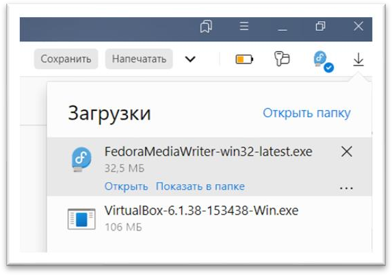{#fig:001 width=60%}

## Выполнение лабораторной работы

2.Настройка VirtualBox, создание каталога с именем пользователя 

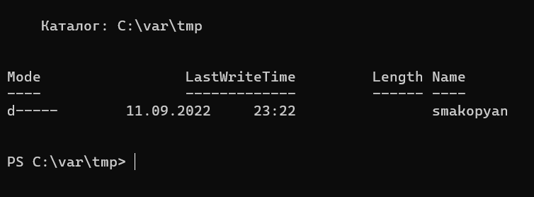{#fig:002 width=70%}

## Выполнение лабораторной работы

Далее необходимо сменить месторасположение каталога для виртуальных машин, а также
сменить хост-клавиши 

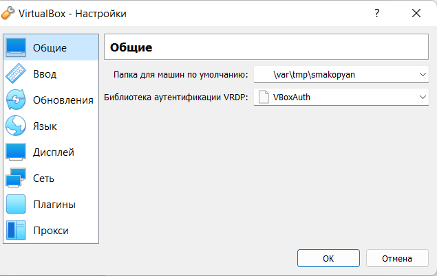{#fig:003 width=60%}

## Выполнение лабораторной работы

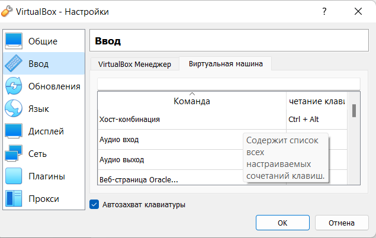{#fig:004 width=60%}

## Выполнение лабораторной работы

4.После произведенных действий нужно создать виртуальную машину, указав при этом тип ОС
Linux, версию Fedora.

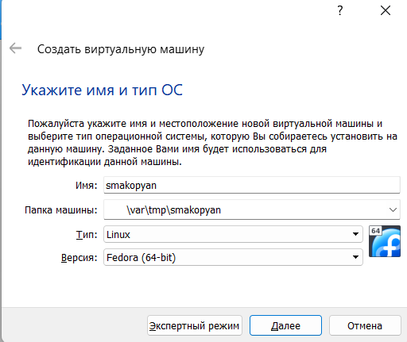{#fig:005 width=60%}

## Выполнение лабораторной работы

5.Объем памяти надо было выбрать от 2048 МБ, у меня это 2048 МБ 

{#fig:006 width=60%}

## Выполнение лабораторной работы

6.Далее я задала конфигурацию жёсткого диска – загрузочный, VDI (VirtualBox Disk Image),
динамический виртуальный диск 

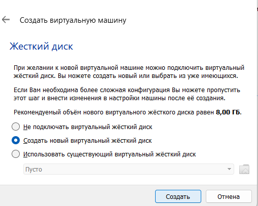{#fig:007 width=50%}

## Выполнение лабораторной работы

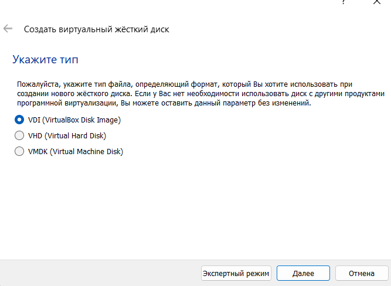{#fig:008 width=50%}

## Выполнение лабораторной работы

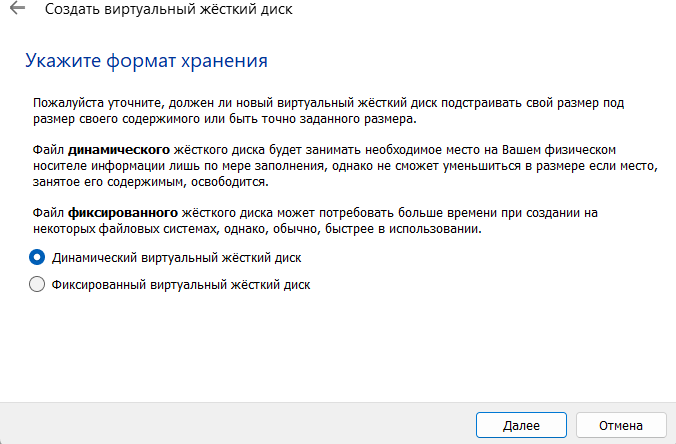{#fig:009 width=50%}

## Выполнение лабораторной работы

7.В окне определения размера виртуального динамического жёсткого диска и его расположения
следует задать размер диска от 80 ГБ, у меня это 80 ГБ. Также увеличиваем доступный объем
видеопамяти до 128 МБ. 

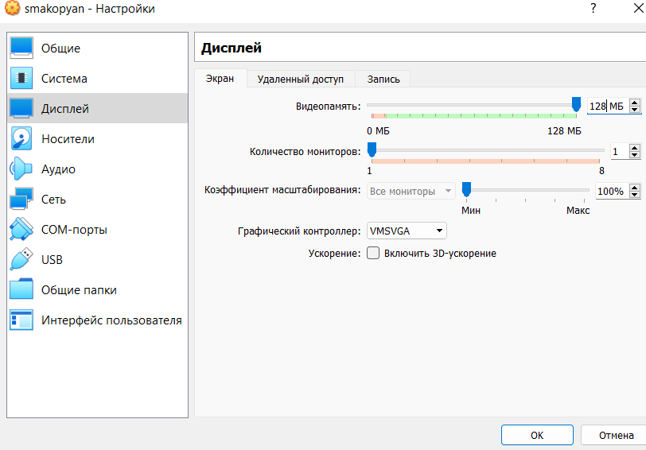{#fig:010 width=50%}

## Выполнение лабораторной работы

8.В настройках виртуальной машины добавляю новый привод оптических дисков и выбираю
заранее скачанный образ операционной системы Fedora 

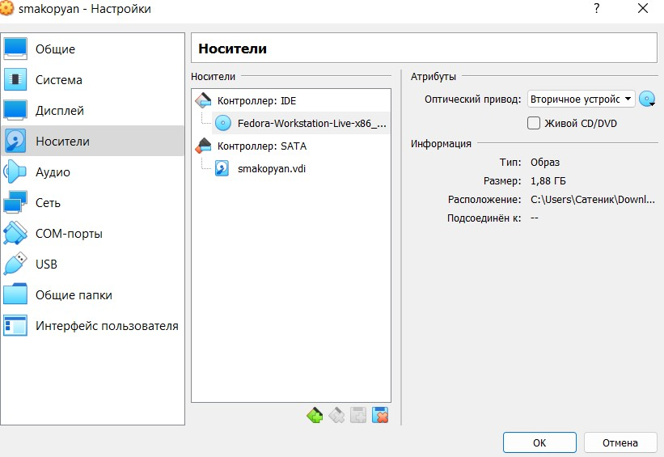{#fig:011 width=50%}

## Выполнение лабораторной работы

9.В окне запуска установки образа ОС выбираю установку на жесткий диск 

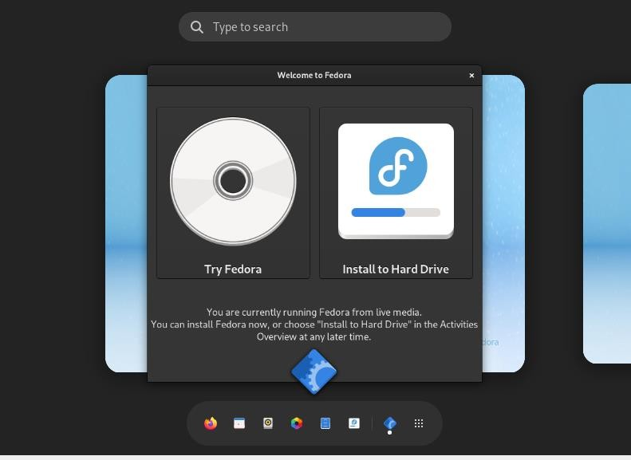{#fig:012 width=50%}

## Выполнение лабораторной работы

10.Корректирую часовой пояс, раскладку клавиатуры 

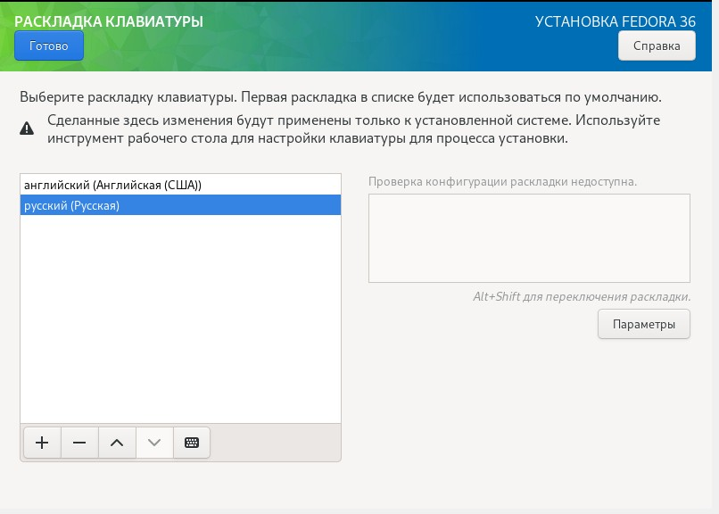{#fig:013 width=50%}

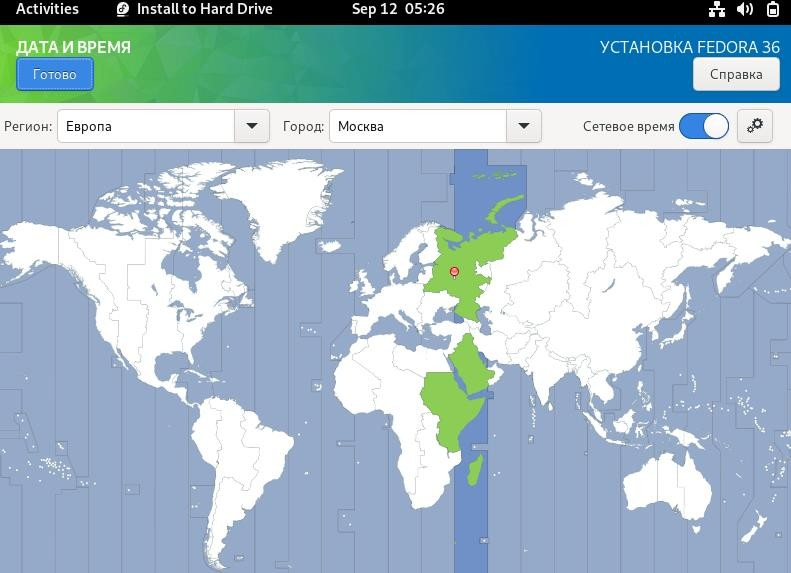{#fig:014 width=50%}

## Выполнение лабораторной работы

11.После всех настроек, нажимаю на кнопку начать установку, после которой создаю имя
пользователя, в соответствии с соглашением об именовании. 

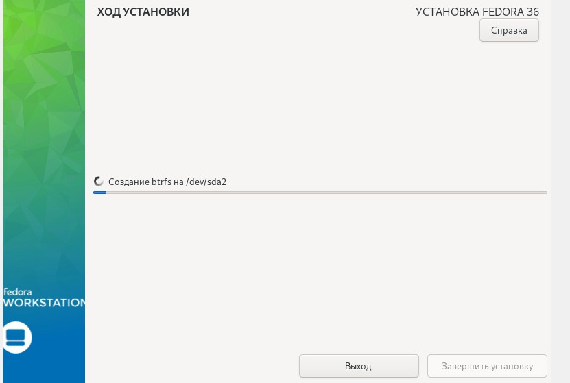{#fig:015 width=50%}

## Выполнение лабораторной работы

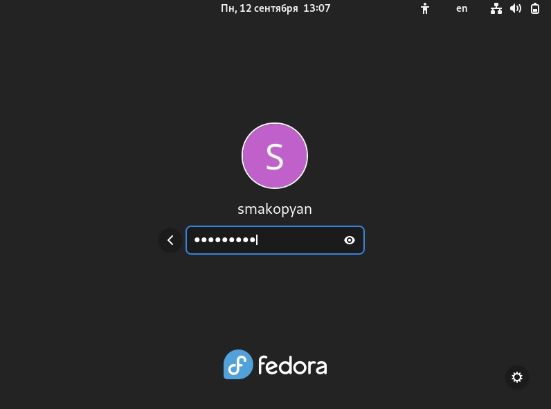{#fig:016 width=50%}

## Выполнение лабораторной работы

12.После окончания установки, следует закрыть окно установщика и выключить систему

13.После того, как виртуальная машина отключится, следует изъять образ диска из дисковода.
После извлечения в диске пусто 

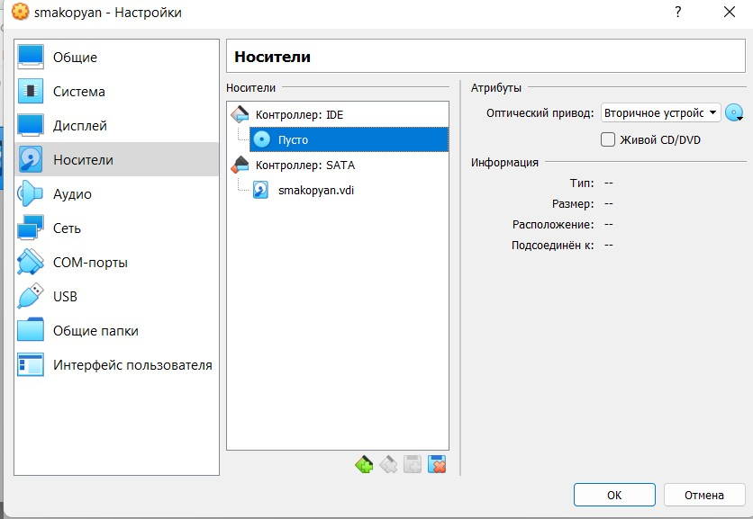{#fig:017 width=50%}

## Выполнение лабораторной работы

14.Устанавливаем программное обеспечение для автоматического обновления и запускаем таймер 

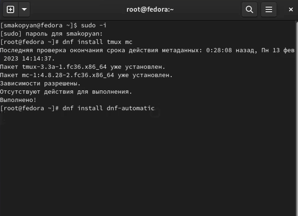{#fig:018 width=50%}

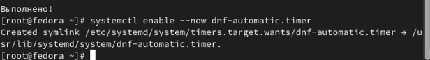{#fig:019 width=50%}

## Выполнение лабораторной работы

15.В данном курсе мы не будем рассматривать работу с системой безопасности SELinux, поэтому В файле /etc/selinux/config замените значение SELINUX=enforcing на значение SELINUX=permissive

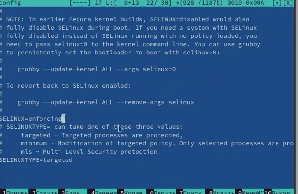{#fig:020 width=50%}

## Выполнение лабораторной работы

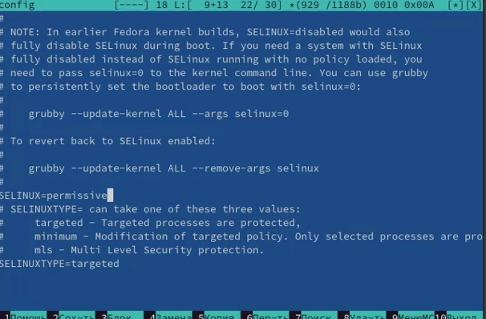{#fig:021 width=50%}

## Выполнение лабораторной работы

16.Отредактируем конфигурационный файл /etc/X11/xorg.conf.d/00-keyboard.conf

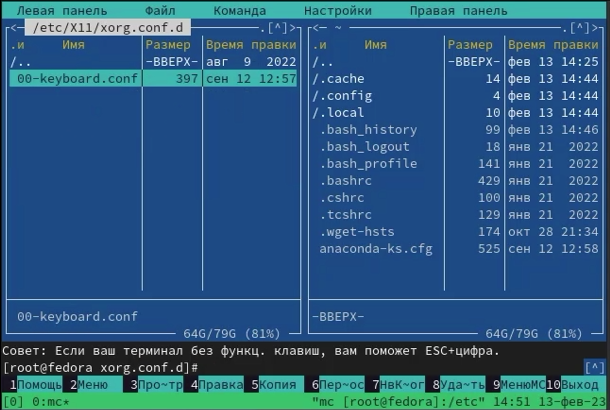{#fig:022 width=70%}

## Выполнение лабораторной работы

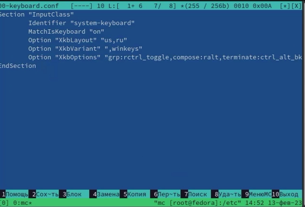{#fig:023 width=70%}

## Выполнение лабораторной работы

17.Проверяем, что pandoc и texlive уже установлены

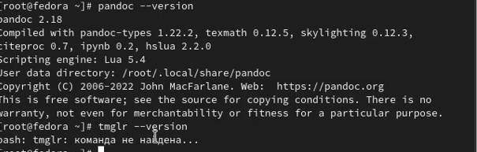{#fig:024 width=70%}

## Домашнее задание

С помощью команды dmesg получаем следующую информацию:

    -Версия ядра Linux (Linux version).
    -Частота процессора (Detected Mhz processor).
    -Модель процессора (CPU0).
    -Объём доступной оперативной памяти (Memory available).
    -Тип обнаруженного гипервизора (Hypervisor detected).
    -Тип файловой системы корневого раздела.
    -Последовательность монтирования файловых систем.

## Выполнение лабораторной работы

{#fig:025 width=70%}

## Выполнение лабораторной работы

{#fig:026 width=70%}

## Выполнение лабораторной работы

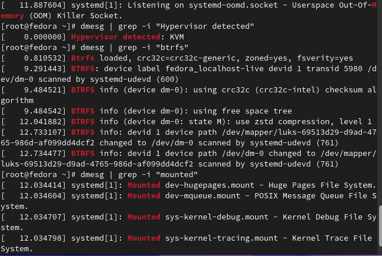{#fig:027 width=70%}
 
