---
## Front matter
title: "Отчет по лабораторной работе №1"
subtitle: "Установка ОС Linux."
author: "Акопян Сатеник Манвеловна"

## Generic otions
lang: ru-RU
toc-title: "Содержание"

## Bibliography
bibliography: bib/cite.bib
csl: pandoc/csl/gost-r-7-0-5-2008-numeric.csl

## Pdf output format
toc: true # Table of contents
toc-depth: 2
lof: true # List of figures
lot: true # List of tables
fontsize: 12pt
linestretch: 1.5
papersize: a4
documentclass: scrreprt
## I18n polyglossia
polyglossia-lang:
  name: russian
  options:
	- spelling=modern
	- babelshorthands=true
polyglossia-otherlangs:
  name: english
## I18n babel
babel-lang: russian
babel-otherlangs: english
## Fonts
mainfont: PT Serif
romanfont: PT Serif
sansfont: PT Sans
monofont: PT Mono
mainfontoptions: Ligatures=TeX
romanfontoptions: Ligatures=TeX
sansfontoptions: Ligatures=TeX,Scale=MatchLowercase
monofontoptions: Scale=MatchLowercase,Scale=0.9
## Biblatex
biblatex: true
biblio-style: "gost-numeric"
biblatexoptions:
  - parentracker=true
  - backend=biber
  - hyperref=auto
  - language=auto
  - autolang=other*
  - citestyle=gost-numeric
## Pandoc-crossref LaTeX customization
figureTitle: "Рис."
tableTitle: "Таблица"
listingTitle: "Листинг"
lofTitle: "Список иллюстраций"
lotTitle: "Список таблиц"
lolTitle: "Листинги"
## Misc options
indent: true
header-includes:
  - \usepackage{indentfirst}
  - \usepackage{float} # keep figures where there are in the text
  - \floatplacement{figure}{H} # keep figures where there are in the text
---

# Цель работы

Целью данной работы является приобретение практических навыков установки операционной системы на виртуальную машину, настройки минимально необходимых для дальнейшей работы сервисов.

# Выполнение лабораторной работы

1.Так как лабораторная работа подразумевает собой установку на виртуальную машину
операционную систему Linux, для начала я установила VirtualBox и скачала необходимый
образ операционной системы(рис. @fig:001).

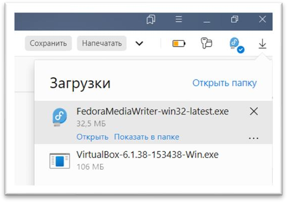{#fig:001 width=70%}

2.Настройка VirtualBox, создание каталога с именем пользователя (рис. @fig:002).

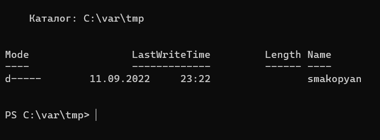{#fig:002 width=70%}

3.Далее необходимо сменить месторасположение каталога для виртуальных машин, а также
сменить хост-клавиши (рис. @fig:003) (рис. @fig:004).

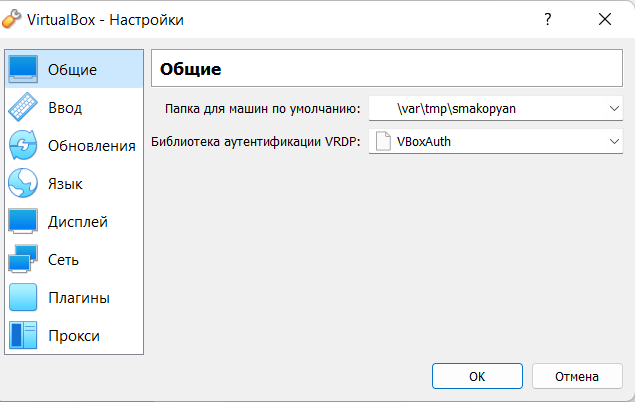{#fig:003 width=70%}

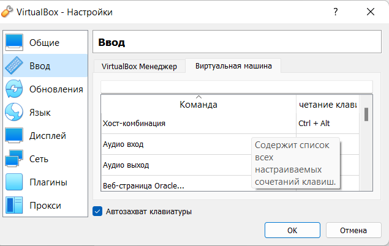{#fig:004 width=70%}

4.После произведенных действий нужно создать виртуальную машину, указав при этом тип ОС
Linux, версию Fedora. (рис. @fig:005)

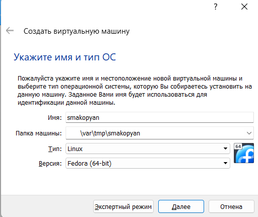{#fig:005 width=70%}

5.Объем памяти надо было выбрать от 2048 МБ, у меня это 2048 МБ (рис. @fig:006)

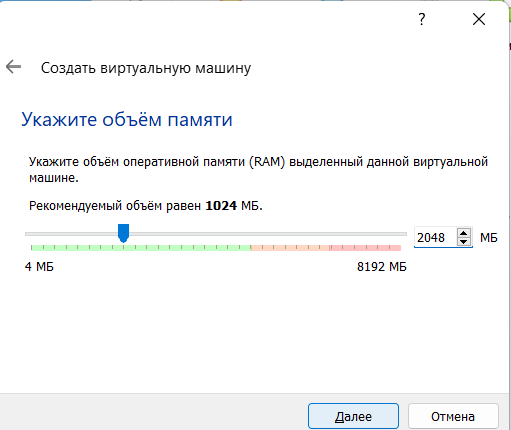{#fig:006 width=70%}

6.Далее я задала конфигурацию жёсткого диска – загрузочный, VDI (VirtualBox Disk Image),
динамический виртуальный диск (рис. @fig:007) (рис. @fig:008) (рис. @fig:009)

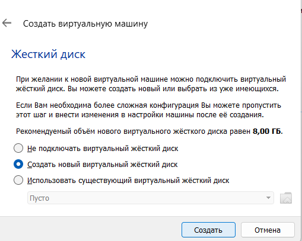{#fig:007 width=70%}

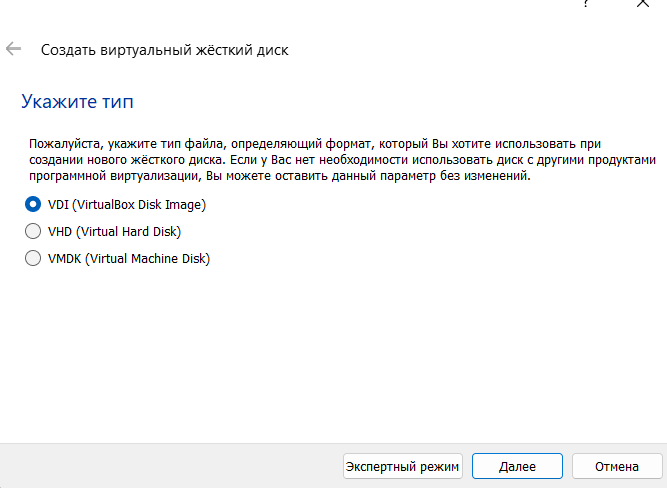{#fig:008 width=70%}

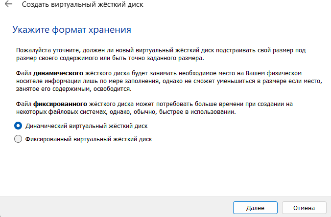{#fig:009 width=70%}

7.В окне определения размера виртуального динамического жёсткого диска и его расположения
следует задать размер диска от 80 ГБ, у меня это 80 ГБ. Также увеличиваем доступный объем
видеопамяти до 128 МБ. (рис. @fig:010)

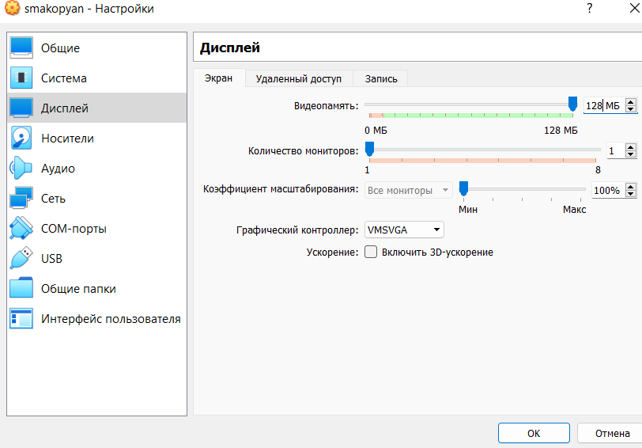{#fig:010 width=70%}

8.В настройках виртуальной машины добавляю новый привод оптических дисков и выбираю
заранее скачанный образ операционной системы Fedora (рис. @fig:011)

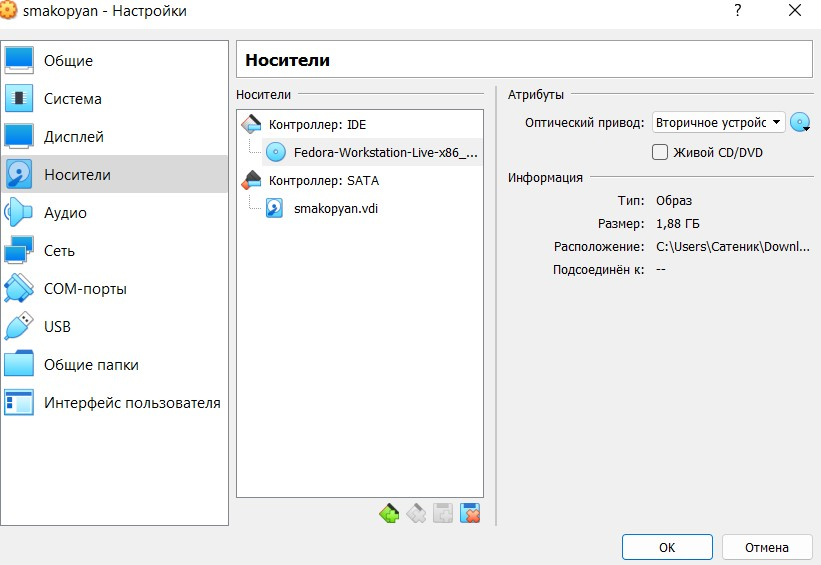{#fig:011 width=70%}

9.В окне запуска установки образа ОС выбираю установку на жесткий диск (рис. @fig:012)

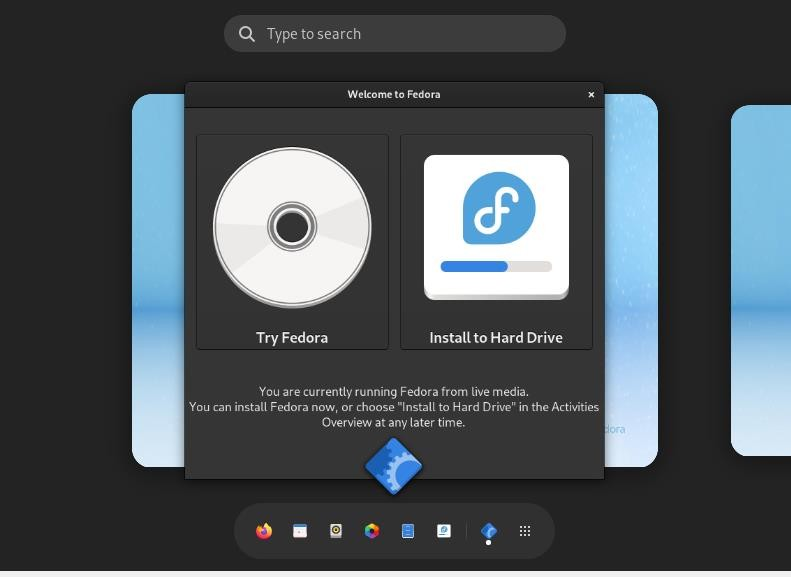{#fig:012 width=70%}

10.Корректирую часовой пояс, раскладку клавиатуры (рис. @fig:013)

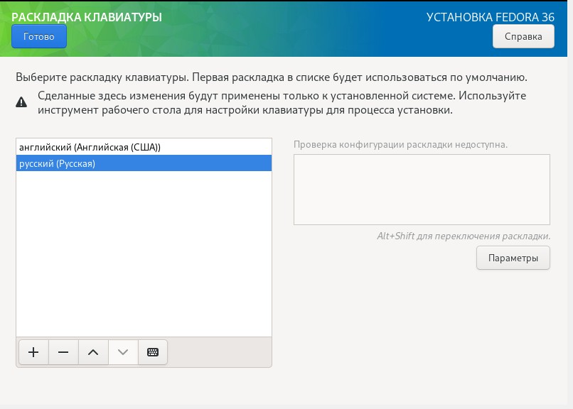{#fig:013 width=70%}

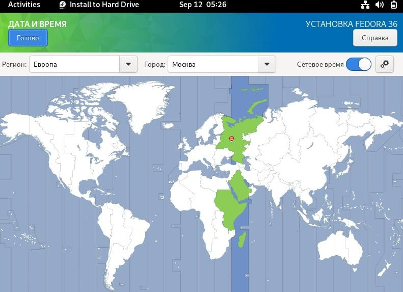{#fig:014 width=70%}

11.После всех настроек, нажимаю на кнопку начать установку, после которой создаю имя
пользователя, в соответствии с соглашением об именовании. (рис. @fig:015) (рис. @fig:016)

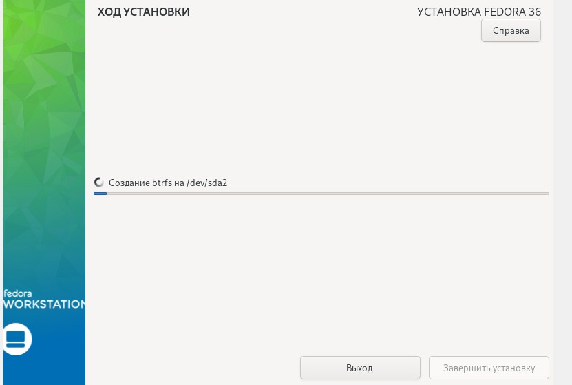{#fig:015 width=70%}

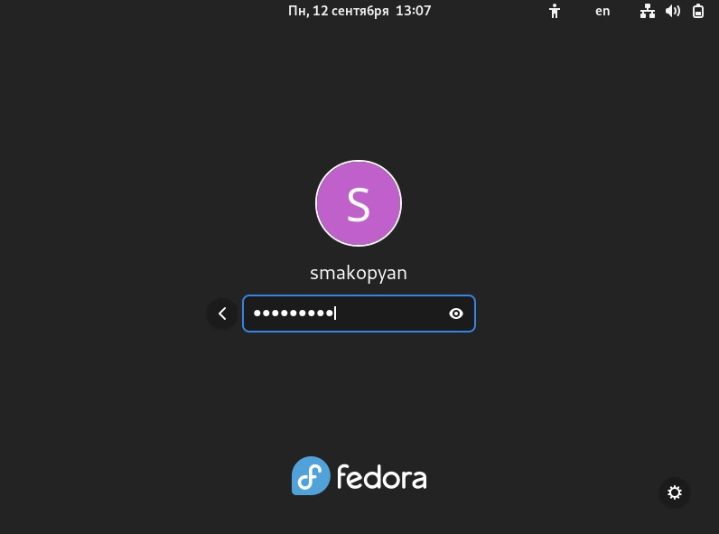{#fig:016 width=70%}

12.После окончания установки, следует закрыть окно установщика и выключить систему

13.После того, как виртуальная машина отключится, следует изъять образ диска из дисковода.
После извлечения в диске пусто (рис. @fig:017)

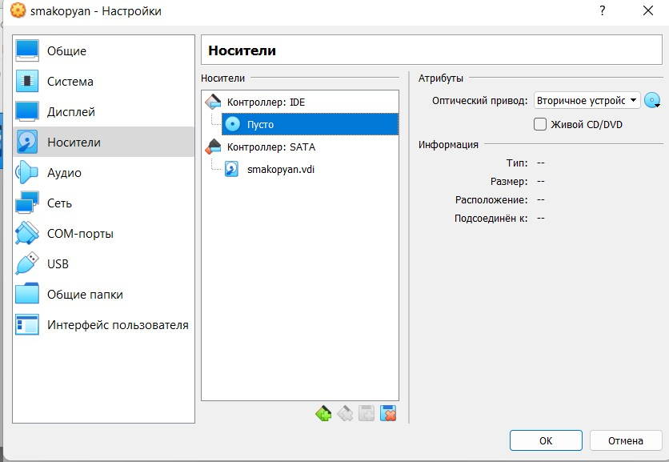{#fig:017 width=70%}

14.Устанавливаем программное обеспечение для автоматического обновления и запускаем таймер (рис. @fig:018)

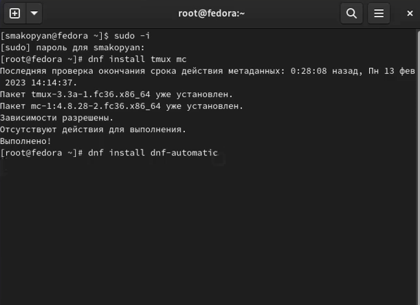{#fig:018 width=70%}

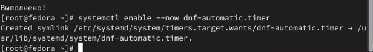{#fig:019 width=70%}

15.В данном курсе мы не будем рассматривать работу с системой безопасности SELinux, поэтому В файле /etc/selinux/config замените значение SELINUX=enforcing на значение SELINUX=permissive

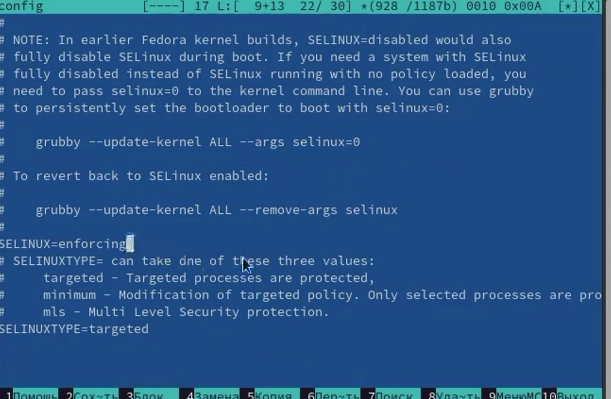{#fig:020 width=70%}

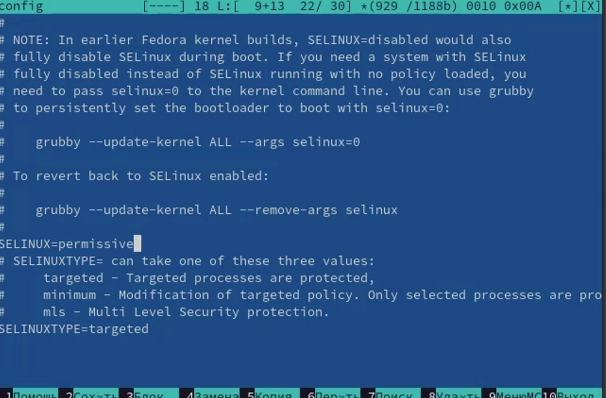{#fig:021 width=70%}

16.Отредактируем конфигурационный файл /etc/X11/xorg.conf.d/00-keyboard.conf

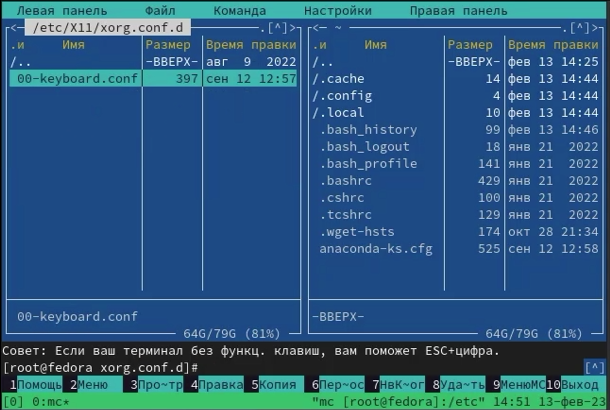{#fig:022 width=70%}

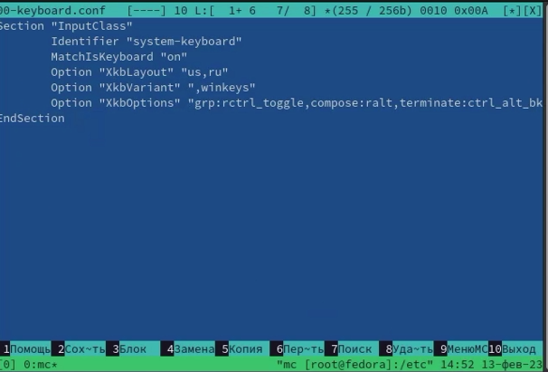{#fig:023 width=70%}

17.Проверяем, что pandoc и texlive уже установлены

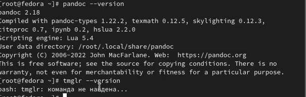{#fig:024 width=70%}

# Домашнее задание

С помощью команды dmesg получаем следующую информацию:

    -Версия ядра Linux (Linux version).
    -Частота процессора (Detected Mhz processor).
    -Модель процессора (CPU0).
    -Объём доступной оперативной памяти (Memory available).
    -Тип обнаруженного гипервизора (Hypervisor detected).
    -Тип файловой системы корневого раздела.
    -Последовательность монтирования файловых систем.

{#fig:025 width=70%}

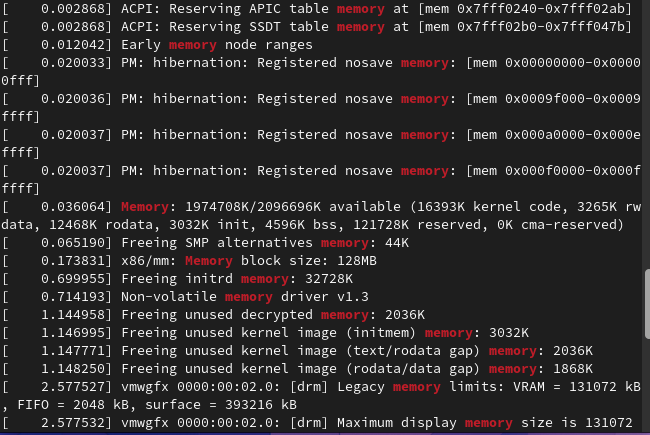{#fig:026 width=70%}

{#fig:027 width=70%}
 
 
# Контрольные вопросы

    1.Какую информацию содержит учётная запись пользователя?
    Имя пользователя, зашифрованный пароль пользователя, идентификационный номер пользователя

    2.Укажите команды терминала и приведите примеры:
        для получения справки по команде: --help, man
        для перемещения по файловой системе: cd
        для просмотра содержимого каталога: ls
        для определения объёма каталога: du
        для создания каталогов: mkdir
        для создания файлов: touch
        удаления каталогов / файлов: rm, rmdir
        для задания определённых прав на файл / каталог: chmod
        для просмотра истории команд: history

    3.Что такое файловая система? Приведите примеры с краткой характеристикой.
    Файловая система – это инструмент, позволяющий операционной системе и программам обращаться к нужным файлам и работать с ними. При этом программы оперируют только названием файла, его размером и датой созданий. Все остальные функции по поиску необходимого файла в хранилище и работе с ним берет на себя файловая система накопителя. 
    4.Как посмотреть, какие файловые системы подмонтированы в ОС?
    Для того, чтобы посмотреть, какие файловые системы подмонтированы в ОС, необходимо воспользоваться командой mount
    5.Как удалить зависший процесс?
    Чтобы удалить зависший процесс, нужно использовать команду kill. 

# Список литературы{.unnumbered}

::: {#refs}
:::
