---
## Front matter
lang: ru-RU
title: Отчет по лабораторной работе №2
subtitle: Первоначальна настройка git
author: 
  - Акопян Сатеник Манвеловна
institute:
  - Российский университет дружбы народов, Москва, Россия
  

## i18n babel
babel-lang: russian
babel-otherlangs: english

## Formatting pdf
toc: false
toc-title: Содержание
slide_level: 2
aspectratio: 169
section-titles: true
theme: metropolis
header-includes:
 - \metroset{progressbar=frametitle,sectionpage=progressbar,numbering=fraction}
 - '\makeatletter'
 - '\beamer@ignorenonframefalse'
 - '\makeatother'
---

## Цель работы

    Изучить идеологию и применение средств контроля версий.
    Освоить умения по работе с git.

## Установка программного обеспечения

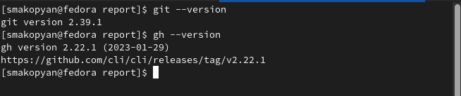{#fig:001 width=50%}

## Базовая настройка git.

Сделаем предварительную конфигурацию git, а так же настроим utf-8 в выводе сообщений git и зададим имя начальной ветки (будем называть её master)

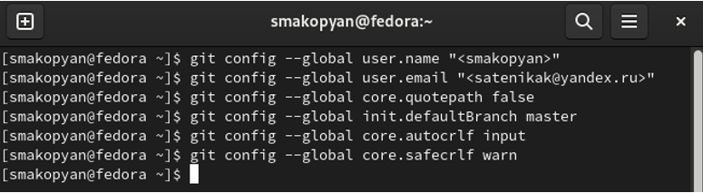{#fig:002 width=50%}

## Создание ключей ssh.

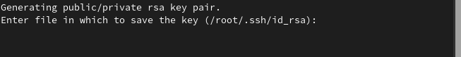{#fig:003 width=50%}

## Создание ключей ssh.

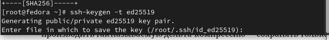{#fig:004 width=50%}

## Создание ключей pgp

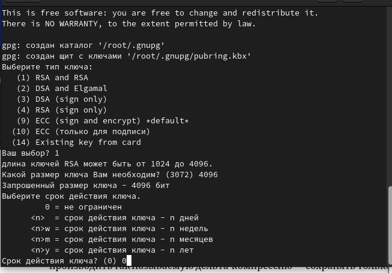{#fig:005 width=50%}

## Настройка github

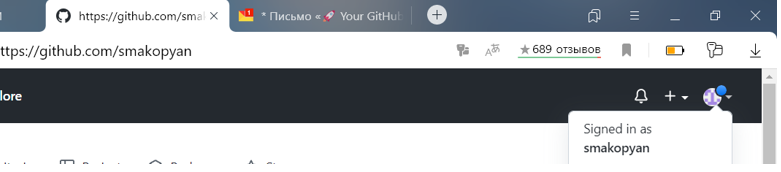{#fig:006 width=50%}

## Добавление PGP ключа в GitHub

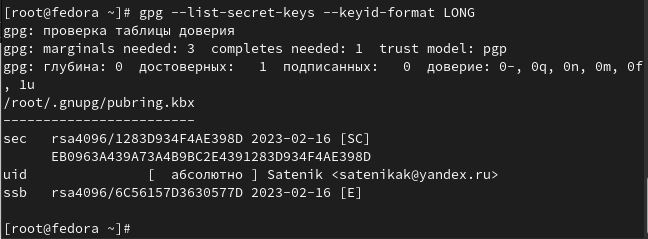{#fig:007 width=50%}

## Добавление PGP ключа в GitHub

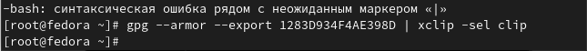{#fig:008 width=50%}

## Настройка автоматических подписей коммитов git

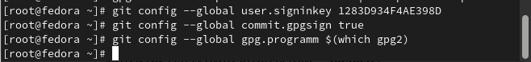{#fig:009 width=50%}

## Настройка gh

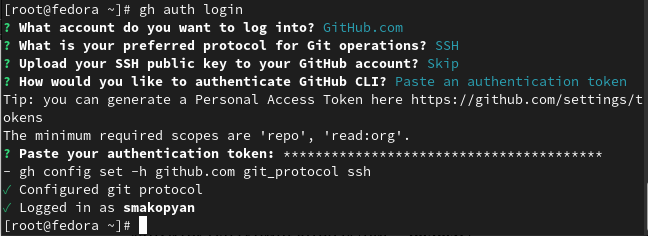{#fig:010 width=50%}

## Создание репозитория курса на основе шаблона

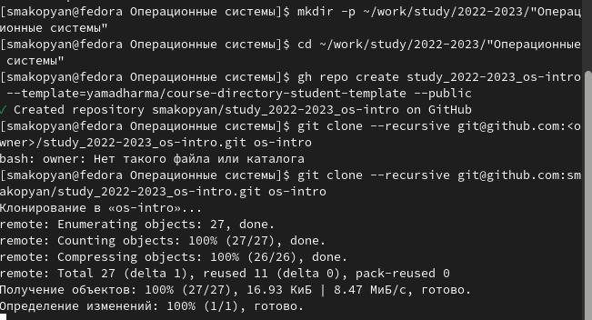{#fig:011 width=50%}

## Создание репозитория курса на основе шаблона

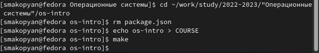{#fig:012 width=50%}

