---
## Front matter
title: "Отчет по лабораторной работе №2"
subtitle: "Первоначальна настройка git"
author: "Акопян Сатеник Манвеловна"

## Generic otions
lang: ru-RU
toc-title: "Содержание"

## Bibliography
bibliography: bib/cite.bib
csl: pandoc/csl/gost-r-7-0-5-2008-numeric.csl

## Pdf output format
toc: true # Table of contents
toc-depth: 2
lof: true # List of figures
lot: true # List of tables
fontsize: 12pt
linestretch: 1.5
papersize: a4
documentclass: scrreprt
## I18n polyglossia
polyglossia-lang:
  name: russian
  options:
	- spelling=modern
	- babelshorthands=true
polyglossia-otherlangs:
  name: english
## I18n babel
babel-lang: russian
babel-otherlangs: english
## Fonts
mainfont: PT Serif
romanfont: PT Serif
sansfont: PT Sans
monofont: PT Mono
mainfontoptions: Ligatures=TeX
romanfontoptions: Ligatures=TeX
sansfontoptions: Ligatures=TeX,Scale=MatchLowercase
monofontoptions: Scale=MatchLowercase,Scale=0.9
## Biblatex
biblatex: true
biblio-style: "gost-numeric"
biblatexoptions:
  - parentracker=true
  - backend=biber
  - hyperref=auto
  - language=auto
  - autolang=other*
  - citestyle=gost-numeric
## Pandoc-crossref LaTeX customization
figureTitle: "Рис."
tableTitle: "Таблица"
listingTitle: "Листинг"
lofTitle: "Список иллюстраций"
lotTitle: "Список таблиц"
lolTitle: "Листинги"
## Misc options
indent: true
header-includes:
  - \usepackage{indentfirst}
  - \usepackage{float} # keep figures where there are in the text
  - \floatplacement{figure}{H} # keep figures where there are in the text
---

# Цель работы

    Изучить идеологию и применение средств контроля версий.
    Освоить умения по работе с git.

# Выполнение лабораторной работы

1.Установка программного обеспечения

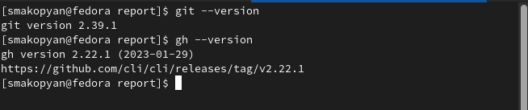{#fig:001 width=70%}

2.Базовая настройка git.Сделаем предварительную конфигурацию git, а так же настроим utf-8 в выводе сообщений git и зададим имя начальной ветки (будем называть её master)

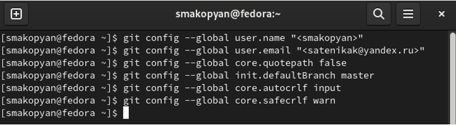{#fig:002 width=70%}

3.Создание ключей ssh.

{#fig:003 width=70%}

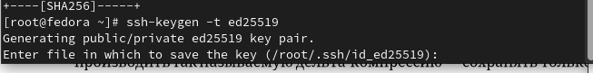{#fig:004 width=70%}

4.Создание ключей pgp

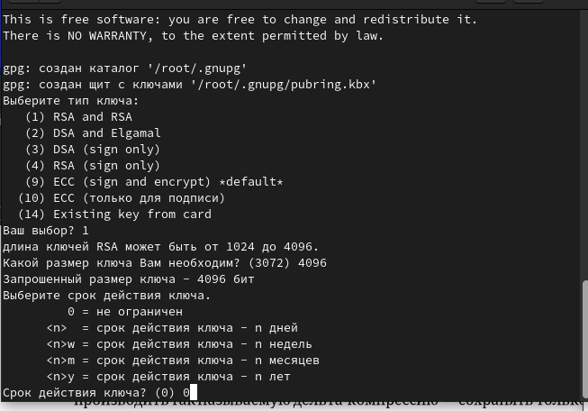{#fig:005 width=70%}

5.Настройка github

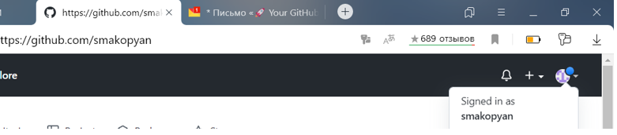{#fig:006 width=70%}

6.Добавление PGP ключа в GitHub

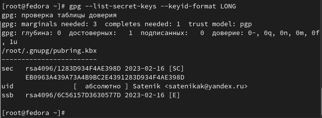{#fig:007 width=70%}

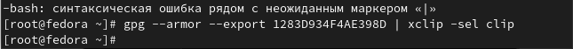{#fig:008 width=70%}

7.Настройка автоматических подписей коммитов git

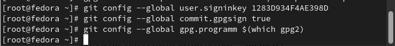{#fig:009 width=70%}

8.Настройка gh

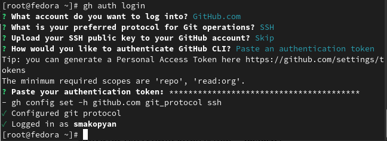{#fig:010 width=70%}

9.Создание репозитория курса на основе шаблона

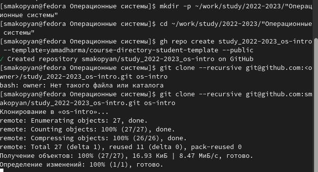{#fig:011 width=70%}

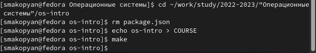{#fig:012 width=70%}

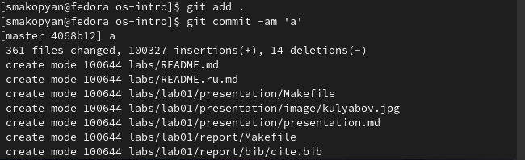{#fig:013 width=70%}
# Контрольные вопросы

    1.Что такое системы контроля версий (VCS) и для решения каких задач они предназначаются?
    Системы контроля версий (Version Control System, VCS) применяются при работе нескольких человек над одним проектом
    
    2.Объясните следующие понятия VCS и их отношения: хранилище, commit, история, рабочая копия.
    Репозиторий - хранилище версий - в нем хранятся все документы вместе с историей их
изменения и другой служебной информацией

commit -редактирует репозиторий, заносит туда изменения

Рабочая копия - копия проекта, связанная с
репозиторием

    3.Что представляют собой и чем отличаются централизованные и децентрализованные VCS? Приведите примеры VCS каждого вида.
    
    Централизованные VCS :одно основное хранилище всего проекта, каждый пользователь копирует себе необходимые ему файлы из этого репозитория, изменяет и, затем, добавляет свои изменения обратно
    Децентрализованные VCS: У каждого пользователя свой вариант (возможно не
один) репозитория, присутствует возможность добавлять и забирать изменения из любого репозитория

    4.Опишите действия с VCS при единоличной работе с хранилищем.
    Cначала создаем и подключаем удаленный репозиторий, затем по мере изменения проекта отправляем проведенные изменения на сервер. 
    
    5.Опишите порядок работы с общим хранилищем VCS.
    Пользователь перед началом работы получает нужную ему версию файлов, после внесения изменений оптравляет их на сервер, предыдущие версии не удаляются, к ним можно вернуться в любой момент.
    
    6.Каковы основные задачи, решаемые инструментальным средством git?
    Основными задачами, решаемыми инструментальным средством git являются: хранение информации о всех изменениях в коде, обеспечение удобства командной работы над кодом.
    
    7.Назовите и дайте краткую характеристику командам git.
    Создание основного дерева репозитория:

git init

Получение обновлений (изменений) текущего дерева из центрального репозитория:

git pull

Отправка всех произведённых изменений локального дерева в центральный репозиторий:

git push

Просмотр списка изменённых файлов в текущей директории:

git status

Просмотр текущих изменений:

git diff

Сохранение текущих изменений:

    добавить все изменённые и/или созданные файлы и/или каталоги:

    git add .

    добавить конкретные изменённые и/или созданные файлы и/или каталоги:

    git add имена_файлов

    удалить файл и/или каталог из индекса репозитория (при этом файл и/или каталог остаётся в локальной директории):

    git rm имена_файлов

Сохранение добавленных изменений:

    сохранить все добавленные изменения и все изменённые файлы:

    git commit -am 'Описание коммита'

    сохранить добавленные изменения с внесением комментария через встроенный редактор:

    git commit

    создание новой ветки, базирующейся на текущей:

    git checkout -b имя_ветки

    переключение на некоторую ветку:

    git checkout имя_ветки

        (при переключении на ветку, которой ещё нет в локальном репозитории, она будет создана и связана с удалённой)

    отправка изменений конкретной ветки в центральный репозиторий:

    git push origin имя_ветки

    слияние ветки с текущим деревом:

    git merge --no-ff имя_ветки

Удаление ветки:

    удаление локальной уже слитой с основным деревом ветки:

    git branch -d имя_ветки

    принудительное удаление локальной ветки:

    git branch -D имя_ветки

    удаление ветки с центрального репозитория:

    git push origin :имя_ветки
    
    8.Приведите примеры использования при работе с локальным и удалённым репозиториями.
    
    9.Что такое и зачем могут быть нужны ветви (branches)?
    
    Ветви нужны для совместной работы над проектом.
    
    10.Как и зачем можно игнорировать некоторые файлы при commit?
    
    Т.к. во время работы над проектом могут создаваться файлы, которые не должны попасть в репозиторий (результаты сборки программ например), то можно создать файл .gitignore с перечислением шаблонов соответствующих таким файлам.
    

# Выводы

В результате данной лабораторной работы, мы изучили идеологию и применение средств контроля версий, а также освоили умения по работе с git.

# Список литературы{.unnumbered}

::: {#refs}
:::
