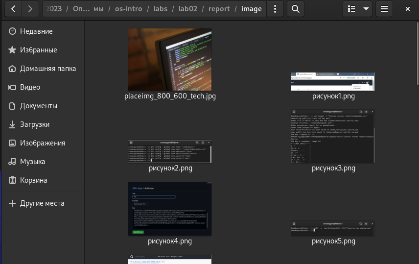
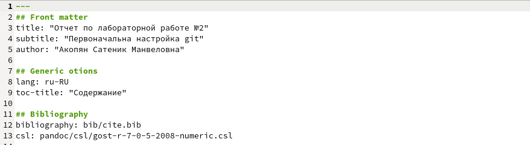
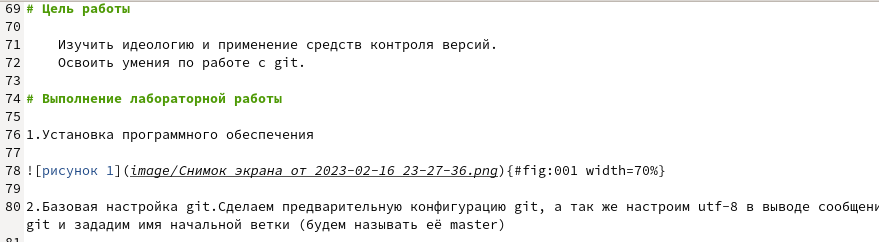
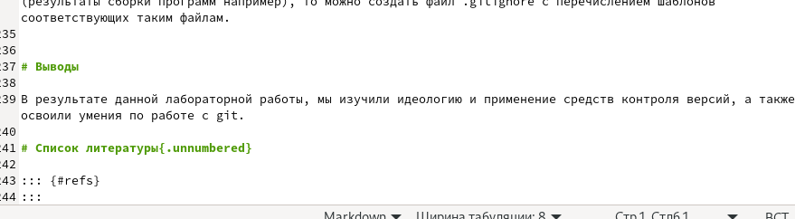

---
## Front matter
lang: ru-RU
title: Отчёт по лабораторной работе №3
subtitle: Markdown
author:
  - Акопян Сатеник Манвеловна
institute:
  - Российский университет дружбы народов, Москва, Россия

## i18n babel
babel-lang: russian
babel-otherlangs: english

## Formatting pdf
toc: false
toc-title: Содержание
slide_level: 2
aspectratio: 169
section-titles: true
theme: metropolis
header-includes:
 - \metroset{progressbar=frametitle,sectionpage=progressbar,numbering=fraction}
 - '\makeatletter'
 - '\beamer@ignorenonframefalse'
 - '\makeatother'
---

## Цель работы

Научиться оформлять отчёты с помощью легковесного языка разметки Markdown.

## Выполнение лабораторной работы

1.В первую очередь, нужно скопировать все картинки, которые будут использованы в лабораторной работе, в папку image.

{#fig:001 width=50%}

## Выполнение лабораторной работы

2.Открываем шаблон отчета по лабораторной работе и меняем необходимые данные (название и автора)

{#fig:002 width=50%}

## Выполнение лабораторной работы

3.Добавляем в лабораторную работу описание проведенных действий и скриншоты к ним

{#fig:003 width=50%}

## Выполнение лабораторной работы

4.Меняем вывод в соответствии с целью данной лабораторной работы

{#fig:004 width=50%}

## Вывод

В результате данной лабораторной работы, я научилась оформлять отчеты с помощью легковесного языка разметки Markdown.

