---
## Front matter
lang: ru-RU
title: Отчёт по лабораторной работе №4
subtitle: Основы интерфейса взаимодействия пользователя с системой Unix на уровне командной строки
author:
  -  Акопян С. М.
institute:
  - Российский университет дружбы народов, Москва, Россия
  

## i18n babel
babel-lang: russian
babel-otherlangs: english

## Formatting pdf
toc: false
toc-title: Содержание
slide_level: 2
aspectratio: 169
section-titles: true
theme: metropolis
header-includes:
 - \metroset{progressbar=frametitle,sectionpage=progressbar,numbering=fraction}
 - '\makeatletter'
 - '\beamer@ignorenonframefalse'
 - '\makeatother'
---
## Выполнение лабораторной работы

1.Определите полное имя вашего домашнего каталога.

Для того, чтобы определить полноe имя домашнего каталога, воспользуемся командой pwd

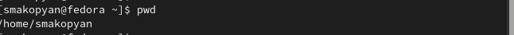{#fig:001 width=50%}

## Выполнение лабораторной работы

2.1.Переходим в каталог /tmp и выводим на экран содержимое каталога /tmp. Для этого следует использовать команду ls с различными опциями (-a показывает в т.ч. скрытые файлы, которые начинаются с .; -l выводит следующую информацию:
– тип файла,
– право доступа,
– число ссылок,
– владелец,
– размер,
– дата последней ревизии,
– имя файла или каталога)

## Выполнение лабораторной работы

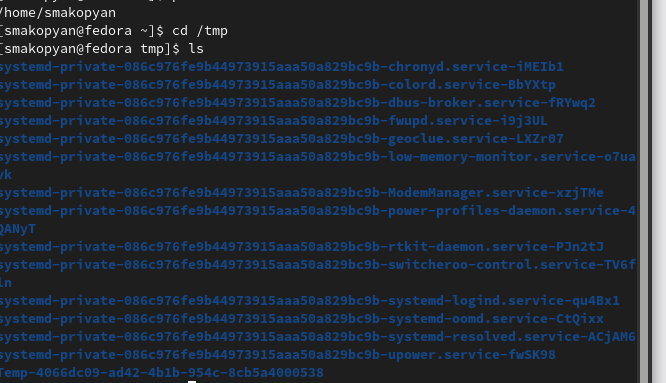{#fig:002 width=50%}

## Выполнение лабораторной работы

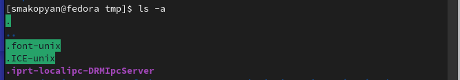{#fig:003 width=50%}

## Выполнение лабораторной работы

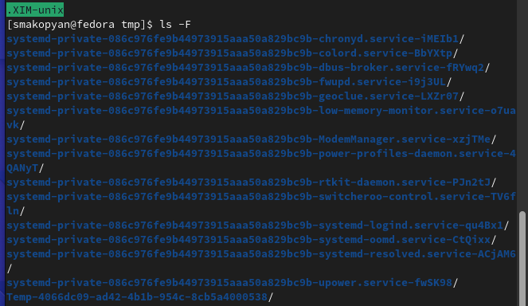{#fig:004 width=50%}

## Выполнение лабораторной работы

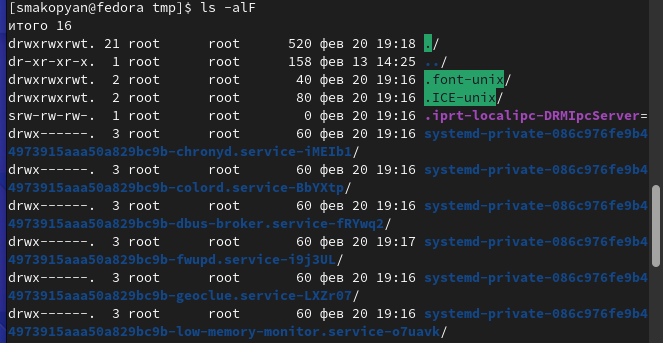{#fig:005 width=50%}

## Выполнение лабораторной работы

2.2.Определим, есть ли в каталоге /var/spool подкаталог с именем cron. С помощью команды ls убеждаемся, что такого подкатолога нет.

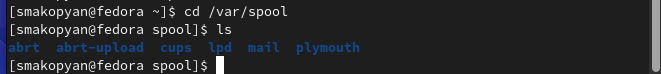{#fig:006 width=50%}

## Выполнение лабораторной работы

2.3. Переходим в домашний каталог и выводим на экран его содержимое, убеждаемся, что владельцем файлов и подкаталогов являюсь я

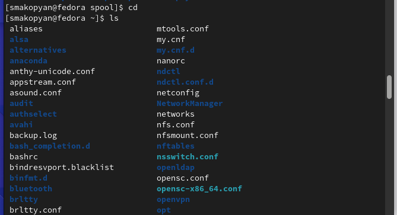{#fig:007 width=50%}

## Выполнение лабораторной работы

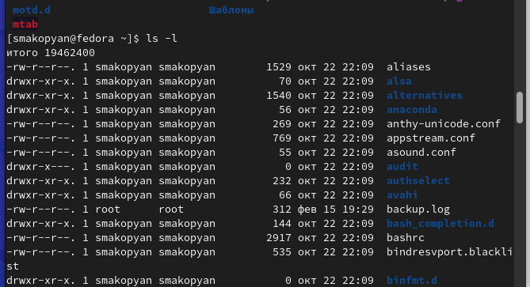{#fig:008 width=50%}

## Выполнение лабораторной работы

3.В домашнем каталоге создаем новый каталог с именем newdir

{#fig:009 width=50%}

## Выполнение лабораторной работы

3.1.В каталоге ~/newdir создаем новый каталог с именем morefun

{#fig:010 width=50%}

## Выполнение лабораторной работы

3.2.В домашнем каталоге создаем одной командой три новых каталога с именами
letters, memos, misk. Затем удаляем эти каталоги одной командой.

{#fig:011 width=50%}

## Выполнение лабораторной работы

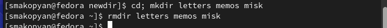{#fig:012 width=50%}

## Выполнение лабораторной работы

3.3.Пробуем удалить ранее созданный каталог ~/newdir командой rm

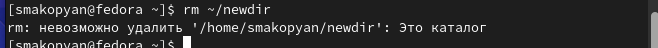{#fig:013 width=50%}

## Выполнение лабораторной работы

3.4.Удаляем каталог ~/newdir/morefun из домашнего каталога. Пытаемся перейти в данный каталог и убеждаемся, что каталог удалён.

{#fig:014 width=50%}

## Выполнение лабораторной работы

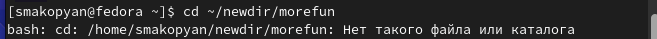{#fig:015 width=50%}

## Выполнение лабораторной работы

4.С помощью команды man определяем, что используя опцию -R команды ls можно просмотреть содержимое не только указанного каталога, но и подкаталогов,входящих в него.

{#fig:016 width=50%}

## Выполнение лабораторной работы

5.С помощью команды man узнаем набор опций команды ls, позволяющий отсортировать по времени последнего изменения выводимый список содержимого каталога с развёрнутым описанием файлов. (-lt)

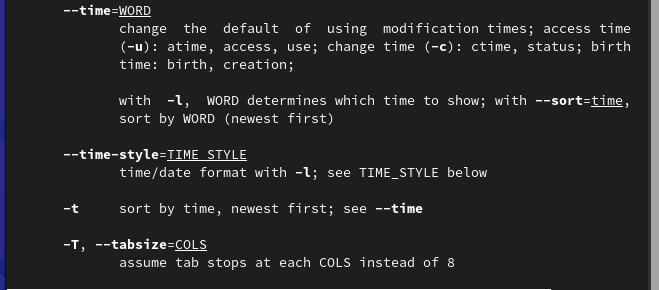{#fig:017 width=50%}

## Выполнение лабораторной работы

6.Используем команду man для просмотра описания следующих команд: cd, pwd, mkdir,
rmdir, rm. 

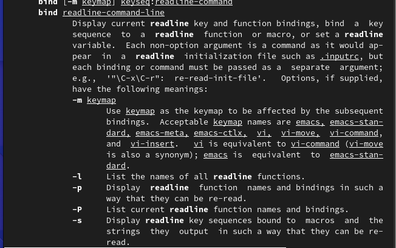{#fig:018 width=50%}

## Выполнение лабораторной работы

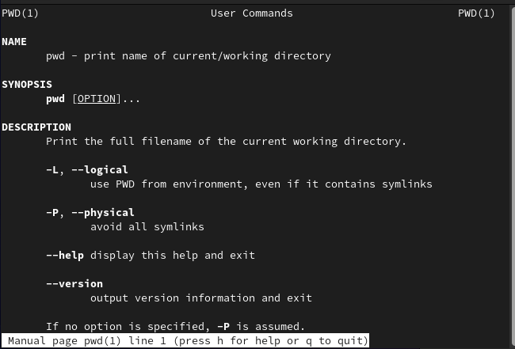{#fig:019 width=50%}

## Выполнение лабораторной работы

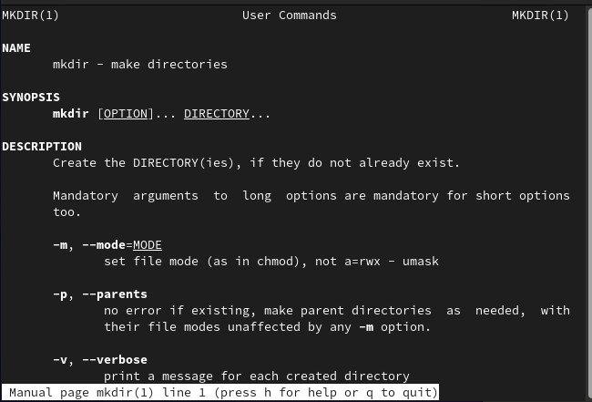{#fig:020 width=50%}

## Выполнение лабораторной работы

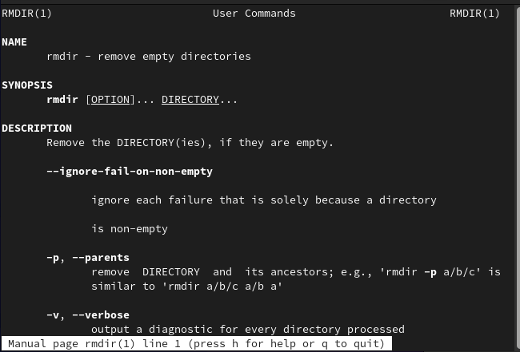{#fig:021 width=50%}

## Выполнение лабораторной работы

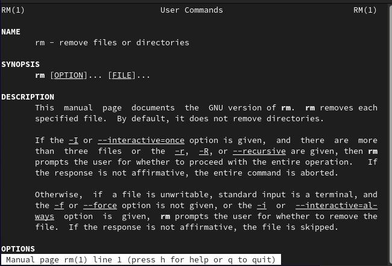{#fig:022 width=50%}

## Выполнение лабораторной работы

7.Используя информацию, полученную при помощи команды history, выполним модификацию и исполнение нескольких команд из буфера команд.

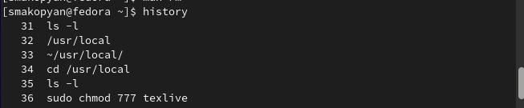{#fig:023 width=50%}

## Выполнение лабораторной работы

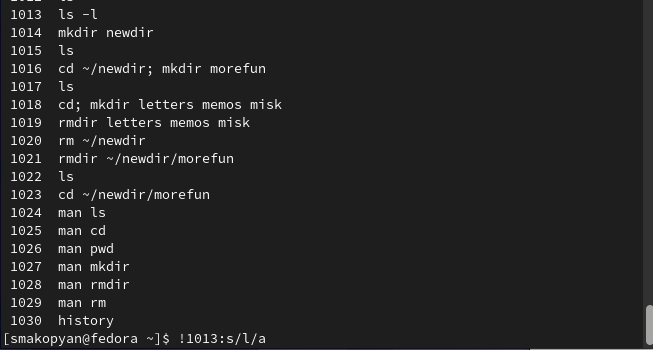{#fig:024 width=50%}

## Выполнение лабораторной работы

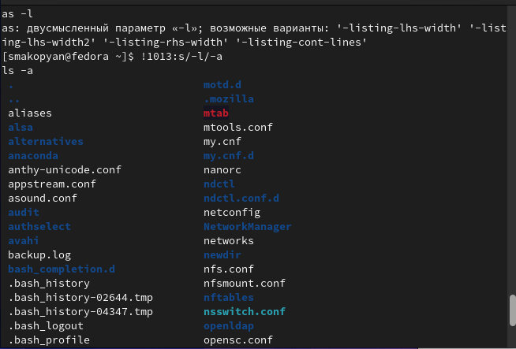{#fig:025 width=50%}

## Выполнение лабораторной работы

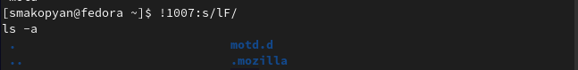{#fig:026 width=50%}

## Выводы

В результате данной лабораторной работы, я приобрела практические навыки взаимодействия пользователя с системой посредством командной строки.

