---
## Front matter
title: "Отчёт по лабораторной работе №4"
subtitle: "Основы интерфейса взаимодействия
пользователя с системой Unix на уровне командной строки"
author: "Акопян Сатеник Манвеловна"

## Generic otions
lang: ru-RU
toc-title: "Содержание"

## Bibliography
bibliography: bib/cite.bib
csl: pandoc/csl/gost-r-7-0-5-2008-numeric.csl

## Pdf output format
toc: true # Table of contents
toc-depth: 2
lof: true # List of figures
lot: true # List of tables
fontsize: 12pt
linestretch: 1.5
papersize: a4
documentclass: scrreprt
## I18n polyglossia
polyglossia-lang:
  name: russian
  options:
	- spelling=modern
	- babelshorthands=true
polyglossia-otherlangs:
  name: english
## I18n babel
babel-lang: russian
babel-otherlangs: english
## Fonts
mainfont: PT Serif
romanfont: PT Serif
sansfont: PT Sans
monofont: PT Mono
mainfontoptions: Ligatures=TeX
romanfontoptions: Ligatures=TeX
sansfontoptions: Ligatures=TeX,Scale=MatchLowercase
monofontoptions: Scale=MatchLowercase,Scale=0.9
## Biblatex
biblatex: true
biblio-style: "gost-numeric"
biblatexoptions:
  - parentracker=true
  - backend=biber
  - hyperref=auto
  - language=auto
  - autolang=other*
  - citestyle=gost-numeric
## Pandoc-crossref LaTeX customization
figureTitle: "Рис."
tableTitle: "Таблица"
listingTitle: "Листинг"
lofTitle: "Список иллюстраций"
lotTitle: "Список таблиц"
lolTitle: "Листинги"
## Misc options
indent: true
header-includes:
  - \usepackage{indentfirst}
  - \usepackage{float} # keep figures where there are in the text
  - \floatplacement{figure}{H} # keep figures where there are in the text
---

# Цель работы

Приобретение практических навыков взаимодействия пользователя с системой по-
средством командной строки.

# Выполнение лабораторной работы

1.Определите полное имя вашего домашнего каталога.

Для того, чтобы определить полноe имя домашнего каталога, воспользуемся командой pwd

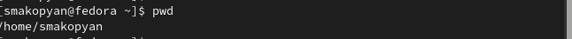{#fig:001 width=70%}

2.1.Переходим в каталог /tmp и выводим на экран содержимое каталога /tmp. Для этого следует использовать команду ls с различными опциями (-a показывает в т.ч. скрытые файлы, которые начинаются с .; -l выводит следующую информацию:
– тип файла,
– право доступа,
– число ссылок,
– владелец,
– размер,
– дата последней ревизии,
– имя файла или каталога)

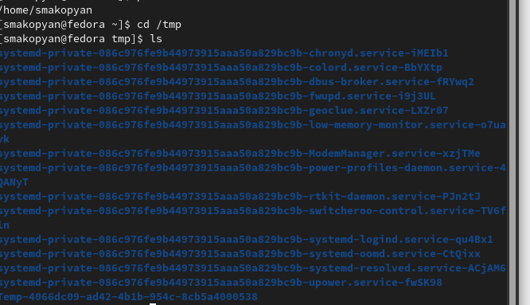{#fig:002 width=70%}

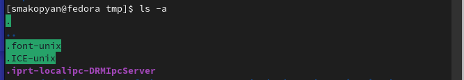{#fig:003 width=70%}

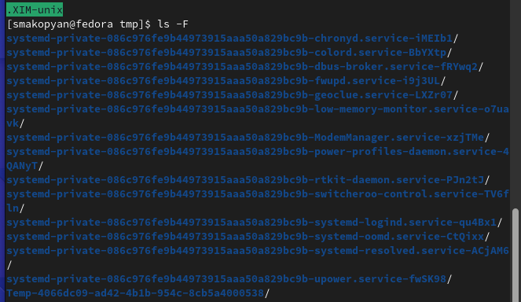{#fig:004 width=70%}

{#fig:005 width=70%}

2.2.Определим, есть ли в каталоге /var/spool подкаталог с именем cron. С помощью команды ls убеждаемся, что такого подкатолога нет.

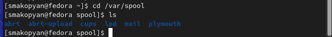{#fig:006 width=70%}

2.3. Переходим в домашний каталог и выводим на экран его содержимое, убеждаемся, что владельцем файлов и подкаталогов являюсь я

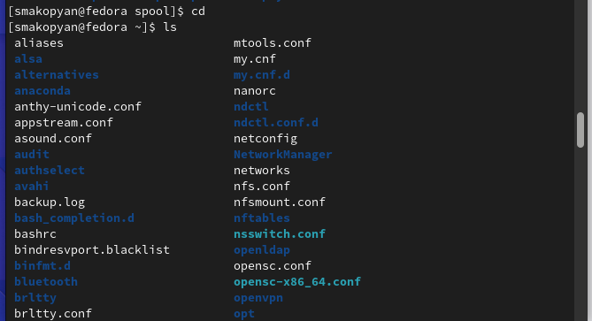{#fig:007 width=70%}

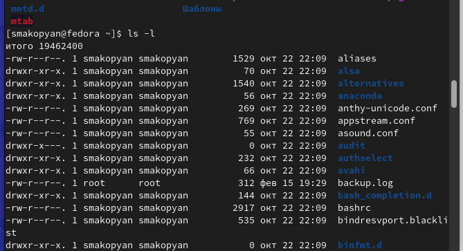{#fig:008 width=70%}

3.В домашнем каталоге создаем новый каталог с именем newdir

{#fig:009 width=70%}

3.1.В каталоге ~/newdir создаем новый каталог с именем morefun

{#fig:010 width=70%}

3.2.В домашнем каталоге создаем одной командой три новых каталога с именами
letters, memos, misk. Затем удаляем эти каталоги одной командой.

{#fig:011 width=70%}

{#fig:012 width=70%}

3.3.Пробуем удалить ранее созданный каталог ~/newdir командой rm

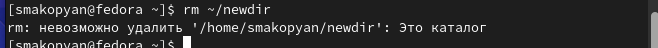{#fig:013 width=70%}

3.4.Удаляем каталог ~/newdir/morefun из домашнего каталога. Пытаемся перейти в данный каталог и убеждаемся, что каталог удалён.

{#fig:014 width=70%}

{#fig:015 width=70%}

4.С помощью команды man определяем, что используя опцию -R команды ls можно просмотреть содержимое не только указанного каталога, но и подкаталогов,входящих в него.

{#fig:016 width=70%}

5.С помощью команды man узнаем набор опций команды ls, позволяющий отсортировать по времени последнего изменения выводимый список содержимого каталога с развёрнутым описанием файлов. (-lt)

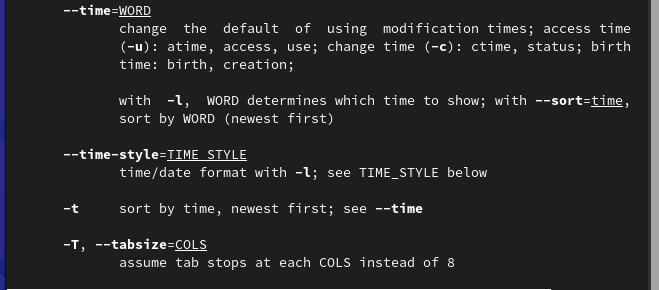{#fig:017 width=70%}

6.Используем команду man для просмотра описания следующих команд: cd, pwd, mkdir,
rmdir, rm. 

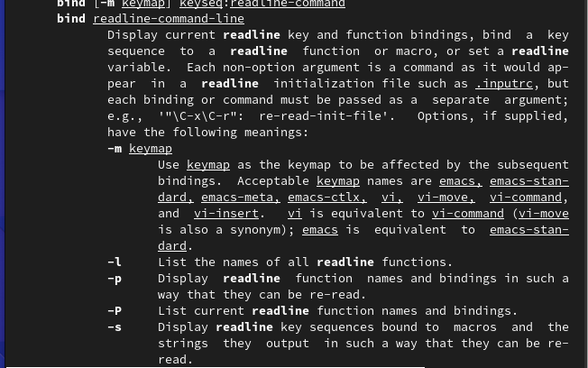{#fig:018 width=70%}

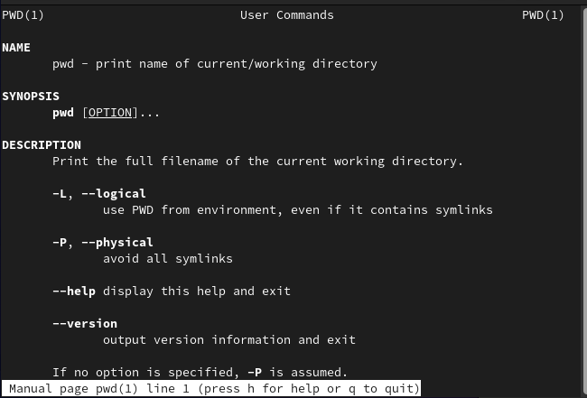{#fig:019 width=70%}

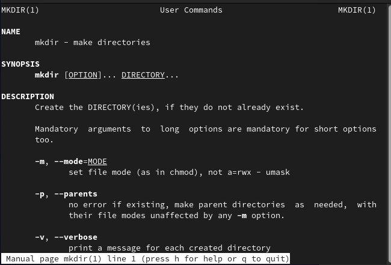{#fig:020 width=70%}

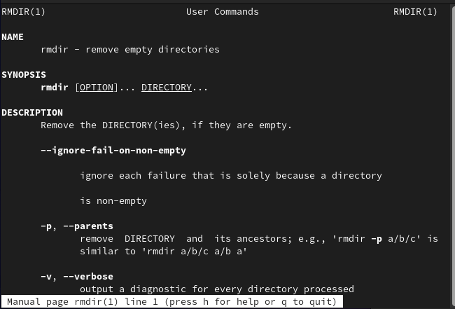{#fig:021 width=70%}

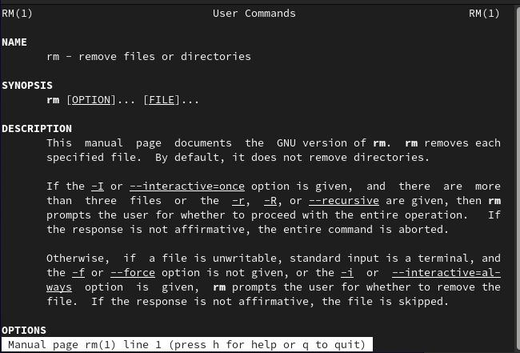{#fig:022 width=70%}

7.Используя информацию, полученную при помощи команды history, выполним модификацию и исполнение нескольких команд из буфера команд.

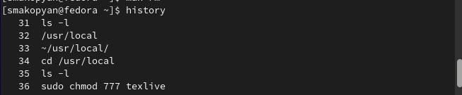{#fig:023 width=70%}

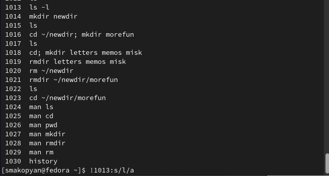{#fig:024 width=70%}

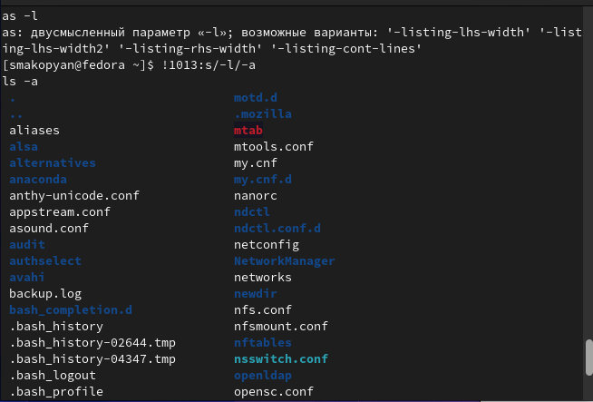{#fig:025 width=70%}

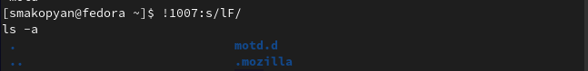{#fig:026 width=70%}

# Контрольные вопросы

1.Что такое командная строка?

В операционной системе типа Linux взаимодействие пользователя с системой обычно
осуществляется с помощью командной строки посредством построчного ввода ко-
манд.

2.При помощи какой команды можно определить абсолютный путь текущего каталога?
Приведите пример.

При помощи команды pwd можно определить абсолютный путь текущего каталога.

/home/smakopyan/work/study/2022-2023/Операционные системы/os-intro/labs/lab04/report

3.При помощи какой команды и каких опций можно определить только тип файлов
и их имена в текущем каталоге? Приведите примеры.

При помощи команды ls и опции -F

bib/  image/  Makefile  pandoc/  report.md

4.Каким образом отобразить информацию о скрытых файлах? Приведите примеры.

При помощи команды ls и опции -а можно отобразить информацию о скрытых файлах.

5.При помощи каких команд можно удалить файл и каталог? Можно ли это сделать
одной и той же командой? Приведите примеры.

При помощи команды rm можно удалить и файл и каталог, при помощи команды rmdir можно удалить пустой каталог, но чтобы удалить непустой каталог, используя команду rm нужно использовать опцию -r. 

6.Каким образом можно вывести информацию о последних выполненных пользовате-
лем командах? работы?

Вывести информацию о последних выполненных пользователем командах можно с помощью команды history.

7.Как воспользоваться историей команд для их модифицированного выполнения? При-
ведите примеры.

Можно модифицировать команду из выведенного на экран списка при помощи следующей конструкции:

!<номер_команды>:s/<что_меняем>/<на_что_меняем>

8.Приведите примеры запуска нескольких команд в одной строке.

Чтобы запустить несколько комманд в одной строке, нужно записать их через ';' (cd; mkdir <название>)

9.Дайте определение и приведите примера символов экранирования.

Если в заданном контексте встречаются специальные символы (типа «.»,
«/», «*» и т.д.), надо перед ними поставить символ экранирования \ (обратный слэш)

10 Охарактеризуйте вывод информации на экран после выполнения команды ls с опцией l.

Чтобы вывести на экран подробную информацию о файлах и каталогах, необходимо
использовать опцию l. При этом о каждом файле и каталоге будет выведена следующая
информация:
– тип файла,
– право доступа,
– число ссылок,
– владелец,
– размер,
– дата последней ревизии,
– имя файла или каталога.

11 Что такое относительный путь к файлу? Приведите примеры использования относи-
тельного и абсолютного пути при выполнении какой-либо команды.

Относительный путь к файлу - это ссылка, указывающая на другие странницы вашего сайта относительно веб-страницы, на которой эта ссылка уже находится.

12 Как получить информацию об интересующей вас команде?

Чтобы получить информацию об интересующей вас команде, можно воспользоваться командой man.

13 Какая клавиша или комбинация клавиш служит для автоматического дополнения
вводимых команд

tab служит для автоматического дополнения вводимых команд

# Выводы

В результате данной лабораторной работы, я приобрела практические навыки взаимодействия пользователя с системой посредством командной строки.

# Список литературы{.unnumbered}

::: {#refs}
:::
