---
## Front matter
title: "Отчет по лабораторной работе №5"
subtitle: "Анализ файловой системы Linux."
author: "Акопян Сатеник Манвеловна"

## Generic otions
lang: ru-RU
toc-title: "Содержание"

## Bibliography
bibliography: bib/cite.bib
csl: pandoc/csl/gost-r-7-0-5-2008-numeric.csl

## Pdf output format
toc: true # Table of contents
toc-depth: 2
lof: true # List of figures
lot: true # List of tables
fontsize: 12pt
linestretch: 1.5
papersize: a4
documentclass: scrreprt
## I18n polyglossia
polyglossia-lang:
  name: russian
  options:
	- spelling=modern
	- babelshorthands=true
polyglossia-otherlangs:
  name: english
## I18n babel
babel-lang: russian
babel-otherlangs: english
## Fonts
mainfont: PT Serif
romanfont: PT Serif
sansfont: PT Sans
monofont: PT Mono
mainfontoptions: Ligatures=TeX
romanfontoptions: Ligatures=TeX
sansfontoptions: Ligatures=TeX,Scale=MatchLowercase
monofontoptions: Scale=MatchLowercase,Scale=0.9
## Biblatex
biblatex: true
biblio-style: "gost-numeric"
biblatexoptions:
  - parentracker=true
  - backend=biber
  - hyperref=auto
  - language=auto
  - autolang=other*
  - citestyle=gost-numeric
## Pandoc-crossref LaTeX customization
figureTitle: "Рис."
tableTitle: "Таблица"
listingTitle: "Листинг"
lofTitle: "Список иллюстраций"
lotTitle: "Список таблиц"
lolTitle: "Листинги"
## Misc options
indent: true
header-includes:
  - \usepackage{indentfirst}
  - \usepackage{float} # keep figures where there are in the text
  - \floatplacement{figure}{H} # keep figures where there are in the text
---

# Цель работы

Ознакомление с файловой системой Linux, её структурой, именами и содержанием
каталогов. Приобретение практических навыков по применению команд для работы
с файлами и каталогами, по управлению процессами (и работами), по проверке исполь-
зования диска и обслуживанию файловой системы.

# Выполнение лабораторной работы

1.Выполним все примеры, приведённые в первой части описания лабораторной работы. (рис. @fig:001).

1.1 Копирование файлов и каталогов

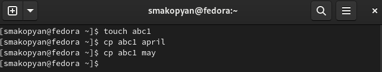{#fig:001 width=70%}

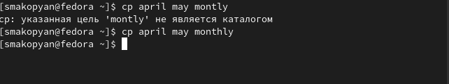{#fig:002 width=70%}

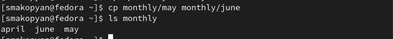{#fig:003 width=70%}

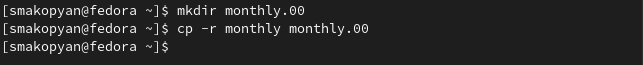{#fig:004 width=70%}

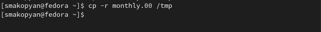{#fig:005 width=70%}

1.2 Перемещение и переименование файлов и каталогов

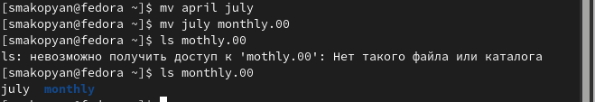{#fig:006 width=70%}

{#fig:007 width=70%}

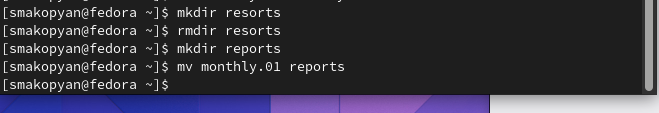{#fig:008 width=70%}

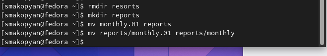{#fig:009 width=70%}

1.3 Изменение прав доступа

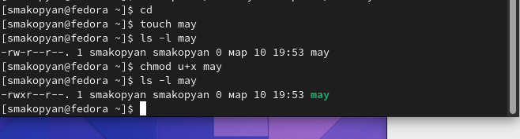{#fig:010 width=70%}

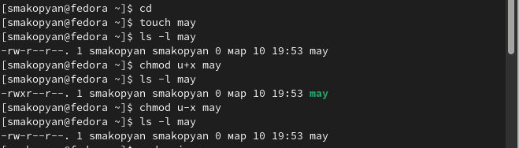{#fig:011 width=70%}

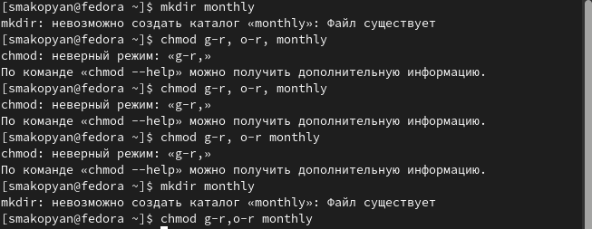{#fig:012 width=70%}

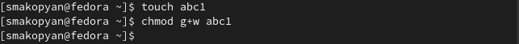{#fig:013 width=70%}

2.1 Скопируйте файл /usr/include/sys/io.h в домашний каталог и назовите его
equipment. 

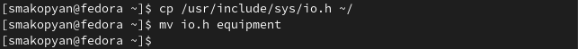{#fig:014 width=70%}

 2.2 В домашнем каталоге создайте директорию ~/ski.plases, переместите файл equipment в каталог ~/ski.plases.
 
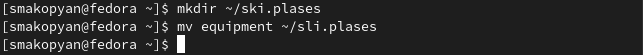{#fig:015 width=70%}
 
2.3 Переименуйте файл ~/ski.plases/equipment в ~/ski.plases/equiplist

{#fig:016 width=70%}
 
2.4Создайте в домашнем каталоге файл abc1 и скопируйте его в каталог
~/ski.plases, назовите его equiplist2. Создайте каталог с именем equipment в каталоге ~/ski.plases. Переместите файлы ~/ski.plases/equiplist и equiplist2 в каталог
~/ski.plases/equipment.

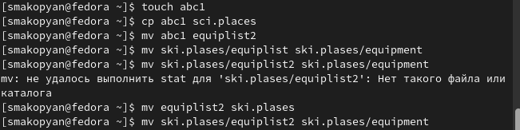{#fig:017 width=70%} 

2.5 Создайте и переместите каталог ~/newdir в каталог ~/ski.plases и назовите
его plans

{#fig:018 width=70%} 

3.Определите опции команды chmod, необходимые для того, чтобы присвоить перечис-
ленным ниже файлам выделенные права доступа, считая, что в начале таких прав
нет:

3.1. drwxr--r-- ... australia

{#fig:019 width=70%} 

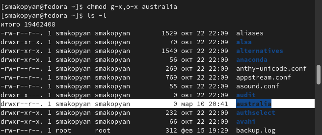{#fig:020 width=70%} 

3.2. drwx--x--x ... play

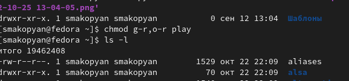{#fig:021 width=70%} 

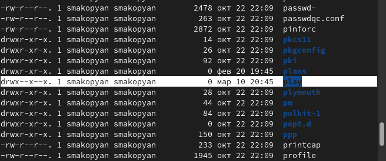{#fig:022 width=70%} 

3.3. -r-xr--r-- ... my_os

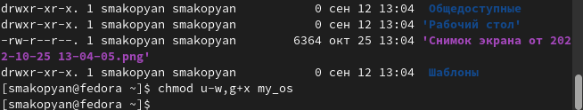{#fig:023 width=70%} 

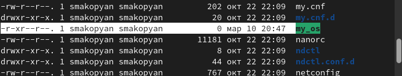{#fig:024 width=70%} 

3.4. -rw-rw-r-- ... feathers

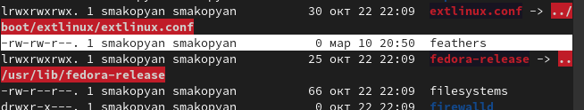{#fig:025 width=70%} 

4.1. Просмотрите содержимое файла /etc/password.

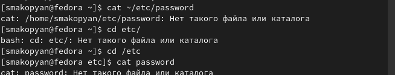{#fig:026 width=70%} 

4.2. Скопируйте файл ~/feathers в файл ~/file.old.

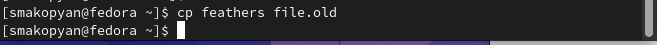{#fig:027 width=70%} 

4.3. Переместите файл ~/file.old в каталог ~/play.

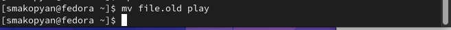{#fig:027 width=70%} 

4.4. Скопируйте каталог ~/play в каталог ~/fun.

{#fig:028 width=70%} 

4.5. Переместите каталог ~/fun в каталог ~/play и назовите его games.

{#fig:029 width=70%} 

4.6. Лишите владельца файла ~/feathers права на чтение.

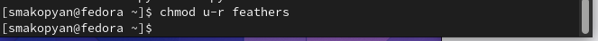{#fig:030 width=70%} 

4.7. Что произойдёт, если вы попытаетесь просмотреть файл ~/feathers командой
cat?

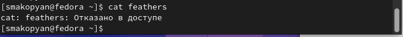{#fig:031 width=70%} 

4.8. Что произойдёт, если вы попытаетесь скопировать файл ~/feathers?

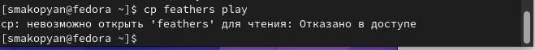{#fig:032 width=70%} 

4.9. Лишите владельца каталога ~/play права на выполнение.

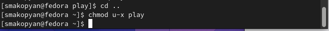{#fig:033 width=70%} 

4.10. Перейдите в каталог ~/play. Что произошло?

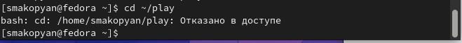{#fig:034 width=70%} 

4.11. Дайте владельцу каталога ~/play право на выполнение.

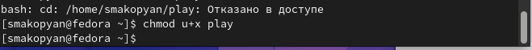{#fig:035 width=70%} 

5.Прочитайте man по командам mount, fsck, mkfs, kill и кратко их охарактеризуйте,
приведя примеры.

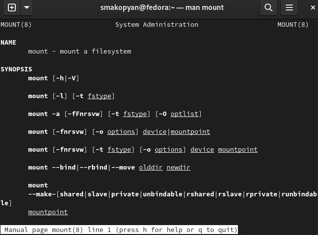{#fig:036 width=70%} 

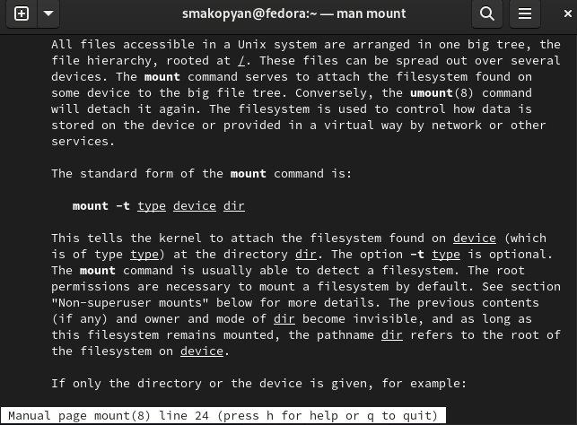{#fig:037 width=70%} 

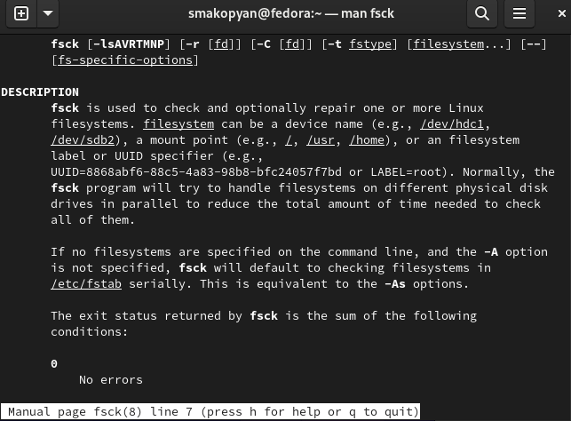{#fig:038 width=70%} 

{#fig:039 width=70%} 

# Выводы

В результате данной лабораторной работы, я ознакомилась с файловой системой Linux, её структурой, именами и содержанием каталогов. Приобрела практические навыки по применению команд для работы
с файлами и каталогами, по управлению процессами (и работами), по проверке использования диска и обслуживанию файловой системы

# Список литературы{.unnumbered}

::: {#refs}
:::
