---
## Front matter
lang: ru-RU
title: Отчет по лабораторной работе №6
subtitle: Поиск файлов. Перенаправление ввода-вывода. Просмотр запущенных процессов
author:
  - Акопян Сатеник Манвеловна
institute:
  - Российский университет дружбы народов, Москва, Россия

## i18n babel
babel-lang: russian
babel-otherlangs: english

## Formatting pdf
toc: false
toc-title: Содержание
slide_level: 2
aspectratio: 169
section-titles: true
theme: metropolis
header-includes:
 - \metroset{progressbar=frametitle,sectionpage=progressbar,numbering=fraction}
 - '\makeatletter'
 - '\beamer@ignorenonframefalse'
 - '\makeatother'
---
## Цель работы

Ознакомление с инструментами поиска файлов и фильтрации текстовых данных.
Приобретение практических навыков: по управлению процессами (и заданиями), по
проверке использования диска и обслуживанию файловых систем

## Выполнение лабораторной работы
1. Осуществите вход в систему, используя соответствующее имя пользователя.

2. Запишите в файл file.txt названия файлов, содержащихся в каталоге /etc. Допишите в этот же файл названия файлов, содержащихся в вашем домашнем каталоге.

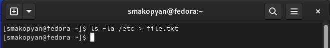{#fig:001 width=70%}

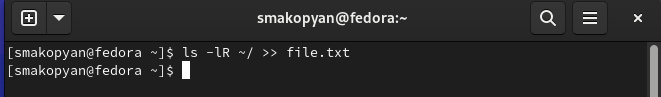{#fig:002 width=70%}

## Выполнение лабораторной работы

3. Выведите имена всех файлов из file.txt, имеющих расширение .conf, после чего
запишите их в новый текстовой файл conf.txt.

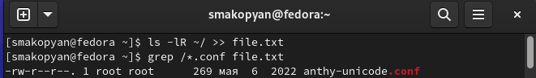{#fig:003 width=70%}

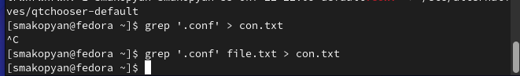{#fig:004 width=70%}

## Выполнение лабораторной работы

4. Определите, какие файлы в вашем домашнем каталоге имеют имена, начинавшиеся
с символа c? Предложите несколько вариантов, как это сделать.

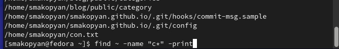{#fig:005 width=70%}

## Выполнение лабораторной работы

5. Выведите на экран (по странично) имена файлов из каталога /etc, начинающиеся
с символа h.

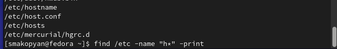{#fig:006 width=70%}

## Выполнение лабораторной работы

6. Запустите в фоновом режиме процесс, который будет записывать в файл ~/logfile
файлы, имена которых начинаются с log.

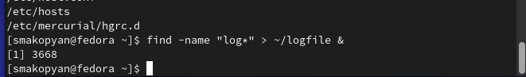{#fig:007 width=70%}

## Выполнение лабораторной работы

7. Удалите файл ~/logfile.

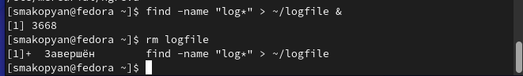{#fig:008 width=70%}

## Выполнение лабораторной работы

8. Запустите из консоли в фоновом режиме редактор gedit.

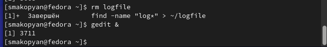{#fig:009 width=70%}

## Выполнение лабораторной работы

9. Определите идентификатор процесса gedit, используя команду ps, конвейер и фильтр
grep. Как ещё можно определить идентификатор процесса?

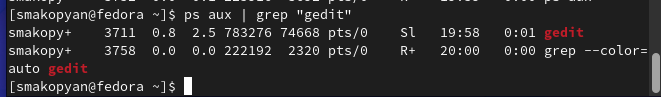{#fig:010 width=70%}

## Выполнение лабораторной работы

10. Прочтите справку (man) команды kill, после чего используйте её для завершения
процесса gedit.

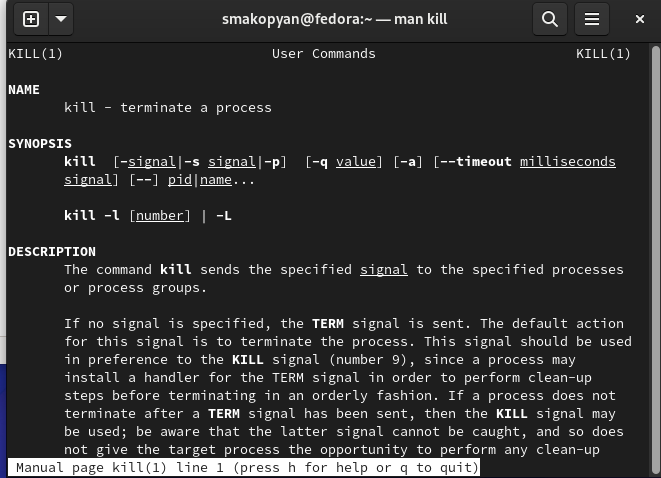{#fig:011 width=70%}

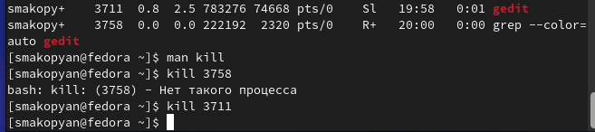{#fig:012 width=70%}

## Выполнение лабораторной работы

11. Выполните команды df и du, предварительно получив более подробную информацию
об этих командах, с помощью команды man.

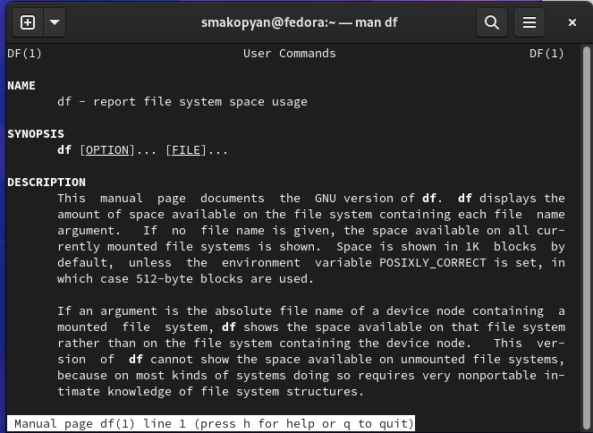{#fig:013 width=50%}

## Выполнение лабораторной работы

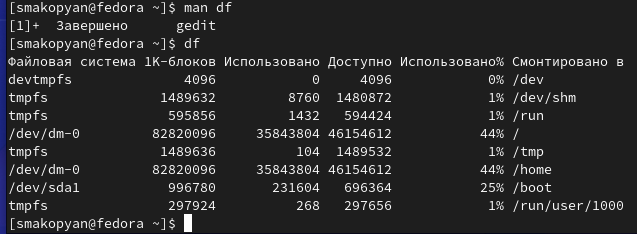{#fig:014 width=50%}

## Выполнение лабораторной работы

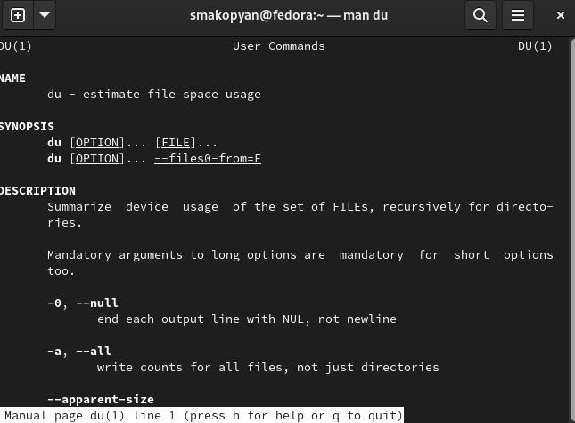{#fig:015 width=70%}

## Выполнение лабораторной работы

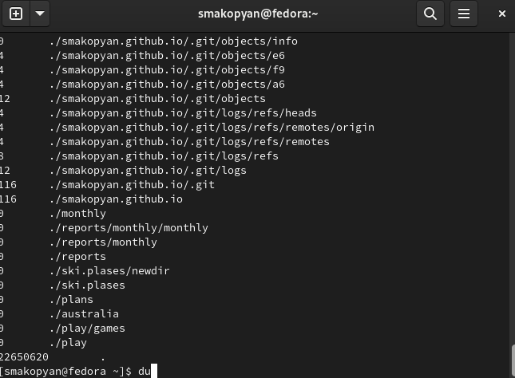{#fig:016 width=70%}

## Выполнение лабораторной работы

12. Воспользовавшись справкой команды find, выведите имена всех директорий, имею-
щихся в вашем домашнем каталогe

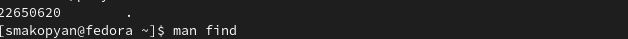{#fig:017 width=70%}

{#fig:018 width=70%}

## Выводы

В результате данный лабораторной работы ознакомилась с инструментами поиска файлов и фильтрации текстовых данных. Приобрела практические навыки: по управлению процессами (и заданиями), по
проверке использования диска и обслуживанию файловых систем.

