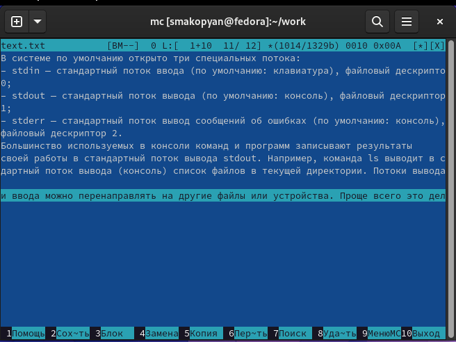

---
## Front matter
lang: ru-RU
title: Лабораторная работа No 7.
subtitle: Командная оболочка Midnight Commander
author:
  - Акопян С.М.
institute:
  - Российский университет дружбы народов, Москва, Россия
  
## i18n babel
babel-lang: russian
babel-otherlangs: english

## Formatting pdf
toc: false
toc-title: Содержание
slide_level: 2
aspectratio: 169
section-titles: true
theme: metropolis
header-includes:
 - \metroset{progressbar=frametitle,sectionpage=progressbar,numbering=fraction}
 - '\makeatletter'
 - '\beamer@ignorenonframefalse'
 - '\makeatother'
---

## Цель работы

Освоение основных возможностей командной оболочки Midnight Commander. Приоб-
ретение навыков практической работы по просмотру каталогов и файлов; манипуляций
с ними.

## Выполнение лабораторной работы

Задание по mc

1. Изучите информацию о mc, вызвав в командной строке man mc.

{#fig:001 width=70%}

## Выполнение лабораторной работы

2. Запустите из командной строки mc, изучите его структуру и меню.

{#fig:002 width=70%}

## Выполнение лабораторной работы

3. Выполните несколько операций в mc, используя управляющие клавиши (операции
с панелями; выделение/отмена выделения файлов, копирование/перемещение фай-
лов, получение информации о размере и правах доступа на файлы и/или каталоги
и т.п.)

{#fig:003 width=70%}

## Выполнение лабораторной работы

4. Выполните основные команды меню левой (или правой) панели. Оцените степень
подробности вывода информации о файлах.

5. Используя возможности подменю Файл , выполните:

– просмотр содержимого текстового файла;

– редактирование содержимого текстового файла (без сохранения результатов
редактирования);

– создание каталога;

– копирование в файлов в созданный каталог.

## Выполнение лабораторной работы

{#fig:004 width=70%}

## Выполнение лабораторной работы

{#fig:005 width=70%}

## Выполнение лабораторной работы

{#fig:006 width=70%}

## Выполнение лабораторной работы

{#fig:007 width=70%}

## Выполнение лабораторной работы

{#fig:008 width=70%}

## Выполнение лабораторной работы

{#fig:009 width=70%}

## Выполнение лабораторной работы

6. С помощью соответствующих средств подменю Команда осуществите:

– поиск в файловой системе файла с заданными условиями (например, файла
с расширением .c или .cpp, содержащего строку main);

– выбор и повторение одной из предыдущих команд;

– переход в домашний каталог;

– анализ файла меню и файла расширений.

## Выполнение лабораторной работы

{#fig:011 width=70%}

## Выполнение лабораторной работы

{#fig:012 width=70%}

## Выполнение лабораторной работы

{#fig:013 width=70%}

## Выполнение лабораторной работы

{#fig:014 width=70%}

## Выполнение лабораторной работы

7. Вызовите подменю Настройки . Освойте операции, определяющие структуру экрана mc
(Full screen, Double Width, Show Hidden Files и т.д.)

{#fig:015 width=70%}

## Выполнение лабораторной работы

{#fig:016 width=70%}

## Выполнение лабораторной работы

Задание по встроенному редактору mc

1. Создайте текстовой файл text.txt.

{#fig:017 width=70%}

## Выполнение лабораторной работы

2. Откройте этот файл с помощью встроенного в mc редактора.

{#fig:018 width=70%}

## Выполнение лабораторной работы

3. Вставьте в открытый файл небольшой фрагмент текста, скопированный из любого
другого файла или Интернета.

4. Проделайте с текстом следующие манипуляции, используя горячие клавиши:

## Выполнение лабораторной работы

4.1. Удалите строку текста.

{#fig:019 width=70%}

## Выполнение лабораторной работы

4.2. Выделите фрагмент текста и скопируйте его на новую строку.

{#fig:020 width=70%}

## Выполнение лабораторной работы

4.3. Выделите фрагмент текста и перенесите его на новую строку.

{#fig:021 width=70%}

## Выполнение лабораторной работы

4.4. Сохраните файл.

{#fig:022 width=70%}

## Выполнение лабораторной работы

4.5. Отмените последнее действие.

{#fig:023 width=70%}

4.6. Сохраните и закройте файл.

## Выполнение лабораторной работы

5. Откройте файл с исходным текстом на некотором языке программирования (напри-
мер C или Java)

{#fig:024 width=70%}

## Выполнение лабораторной работы

6. Используя меню редактора, включите подсветку синтаксиса, если она не включена,
или выключите, если она включен

{#fig:025 width=70%}

## Выполнение лабораторной работы

{#fig:026 width=70%}

## Выводы

В результате данной лабораторной работы, я освоила основные возможности командной оболочки Midnight Commander. Приобретела навыки практической работы по просмотру каталогов и файлов; манипуляций
с ними.

