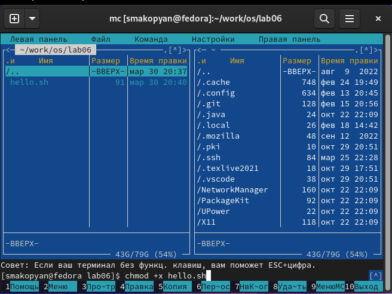

---
## Front matter
lang: ru-RU
title: Лабораторная работа No 8
subtitle: Текстовой редактор vi
author:
  - Акопян Сатеник Манвеловна
institute:
  - Российский университет дружбы народов, Москва, Россия

## i18n babel
babel-lang: russian
babel-otherlangs: english

## Formatting pdf
toc: false
toc-title: Содержание
slide_level: 2
aspectratio: 169
section-titles: true
theme: metropolis
header-includes:
 - \metroset{progressbar=frametitle,sectionpage=progressbar,numbering=fraction}
 - '\makeatletter'
 - '\beamer@ignorenonframefalse'
 - '\makeatother'
---
## Цель работы

Познакомиться с операционной системой Linux. Получить практические навыки работы с редактором vi, установленным по умолчанию практически во всех дистрибутивах.

## Выполнение лабораторной работы

Задание 1. Создание нового файла с использованием vi

1. Создайте каталог с именем ~/work/os/lab06.

{#fig:001 width=50%}

## Выполнение лабораторной работы

2. Перейдите во вновь созданный каталог.

{#fig:002 width=50%}

## Выполнение лабораторной работы

3. Вызовите vi и создайте файл hello.sh vi 

{#fig:003 width=50%}

## Выполнение лабораторной работы

4. Нажмите клавишу i и вводите следующий текст.

{#fig:004 width=50%}

## Выполнение лабораторной работы

5. Нажмите клавишу Esc для перехода в командный режим после завершения ввода
текста.

6. Нажмите : для перехода в режим последней строки и внизу вашего экрана появится
приглашение в виде двоеточия.

7. Нажмите w (записать) и q (выйти), а затем нажмите клавишу Enter для сохранения
вашего текста и завершения работы.

## Выполнение лабораторной работы

8. Сделайте файл исполняемым

{#fig:005 width=50%}

## Выполнение лабораторной работы

Задание 2. Редактирование существующего файла

1. Вызовите vi на редактирование файла

{#fig:006 width=50%}

## Выполнение лабораторной работы

2. Установите курсор в конец слова HELL второй строки.

{#fig:007 width=50%}

## Выполнение лабораторной работы

3. Перейдите в режим вставки и замените на HELLO. Нажмите Esc для возврата в командный режим.

4. Установите курсор на четвертую строку и сотрите слово LOCAL.

{#fig:008 width=50%}

## Выполнение лабораторной работы

5. Перейдите в режим вставки и наберите следующий текст: local, нажмите Esc для возврата в командный режим.

{#fig:009 width=50%}

## Выполнение лабораторной работы

6. Установите курсор на последней строке файла. Вставьте после неё строку, содержащую
следующий текст: echo $HELLO.

{#fig:010 width=50%}

## Выполнение лабораторной работы

7. Нажмите Esc для перехода в командный режим.

8. Удалите последнюю строку.

{#fig:011 width=50%}

## Выполнение лабораторной работы

9. Введите команду отмены изменений u для отмены последней команды.

10. Введите символ : для перехода в режим последней строки. Запишите произведённые
изменения и выйдите из vi.

{#fig:012 width=50%}

## Выводы

В результате данной лабораторной работы, я познакомилась с операционной системой Linux. Получила практические навыки работы с редактором vi, установленным по умолчанию практически во всех дистрибутивах.

# Список литературы{.unnumbered}

::: {#refs}
:::

