---
## Front matter
lang: ru-RU
title: Лабораторная работа No 9
subtitle: Текстовой редактор emacs
author:
  - Акопян Сатеник Манвеловна
institute:
  - Российский университет дружбы народов, Москва, Россия

## i18n babel
babel-lang: russian
babel-otherlangs: english

## Formatting pdf
toc: false
toc-title: Содержание
slide_level: 2
aspectratio: 169
section-titles: true
theme: metropolis
header-includes:
 - \metroset{progressbar=frametitle,sectionpage=progressbar,numbering=fraction}
 - '\makeatletter'
 - '\beamer@ignorenonframefalse'
 - '\makeatother'
---

## Цель работы

Познакомиться с операционной системой Linux. Получить практические навыки рабо-
ты с редактором Emacs.

## Выполнение лабораторной работы

1. Открыть emacs.

{#fig:001 width=50%}

## Выполнение лабораторной работы

2. Создать файл lab07.sh с помощью комбинации Ctrl-x Ctrl-f (C-x C-f).

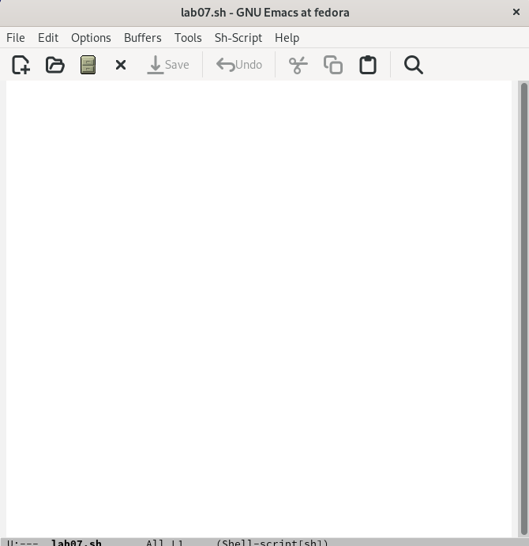{#fig:002 width=50%}

## Выполнение лабораторной работы

3. Наберите текст

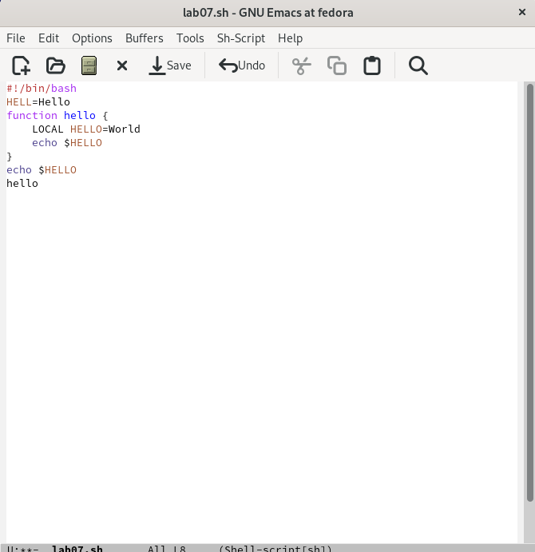{#fig:003 width=50%}

## Выполнение лабораторной работы

4. Сохранить файл с помощью комбинации Ctrl-x Ctrl-s (C-x C-s).

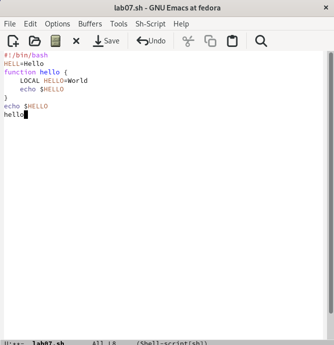{#fig:004 width=50%}

## Выполнение лабораторной работы

5. Проделать с текстом стандартные процедуры редактирования, каждое действие долж-
но осуществляться комбинацией клавиш.

5.1. Вырезать одной командой целую строку (С-k).

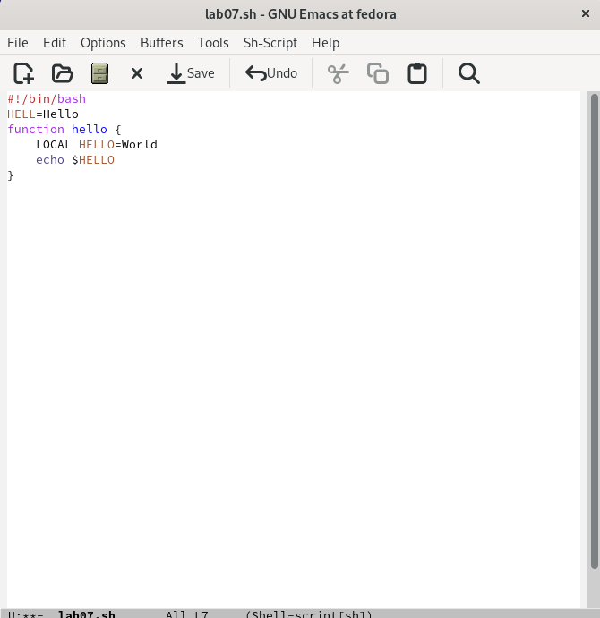{#fig:005 width=50%}

## Выполнение лабораторной работы

5.2. Вставить эту строку в конец файла (C-y).

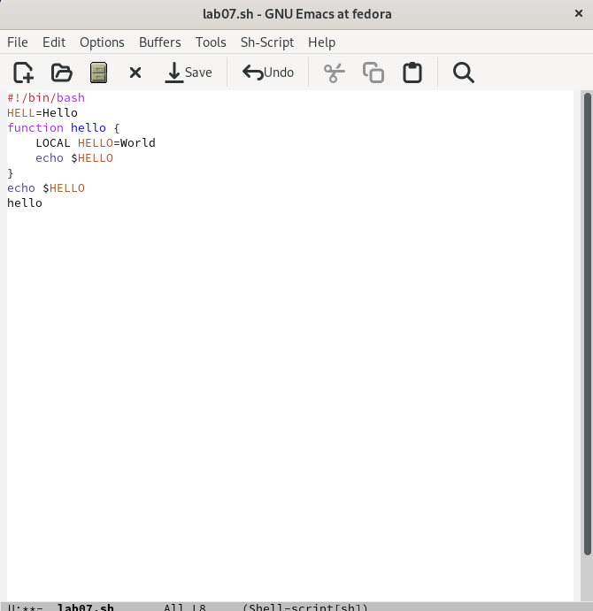{#fig:006 width=50%}

## Выполнение лабораторной работы

5.3. Выделить область текста (C-space).

5.4. Скопировать область в буфер обмена (M-w).

5.5. Вставить область в конец файла.

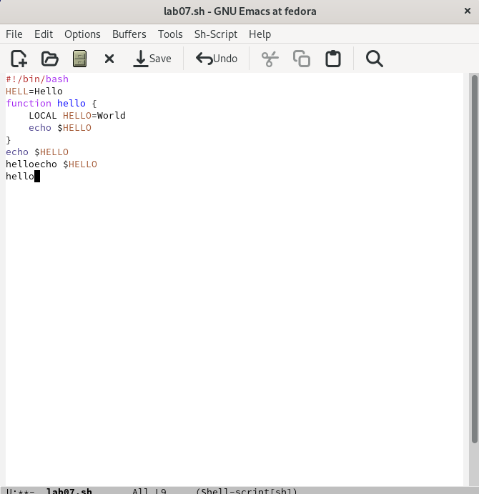{#fig:007 width=50%}

## Выполнение лабораторной работы

5.6. Вновь выделить эту область и на этот раз вырезать её (C-w).

{#fig:008 width=50%}

## Выполнение лабораторной работы

5.7. Отмените последнее действие (C-/).

{#fig:009 width=50%}

## Выполнение лабораторной работы

6. Научитесь использовать команды по перемещению курсора.

6.1. Переместите курсор в начало строки (C-a).

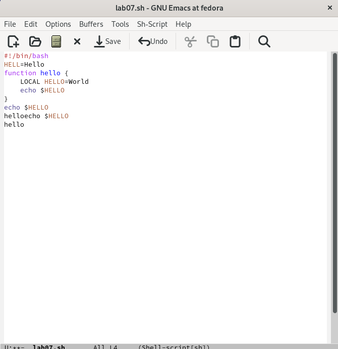{#fig:010 width=50%}

## Выполнение лабораторной работы

6.2. Переместите курсор в конец строки (C-e).

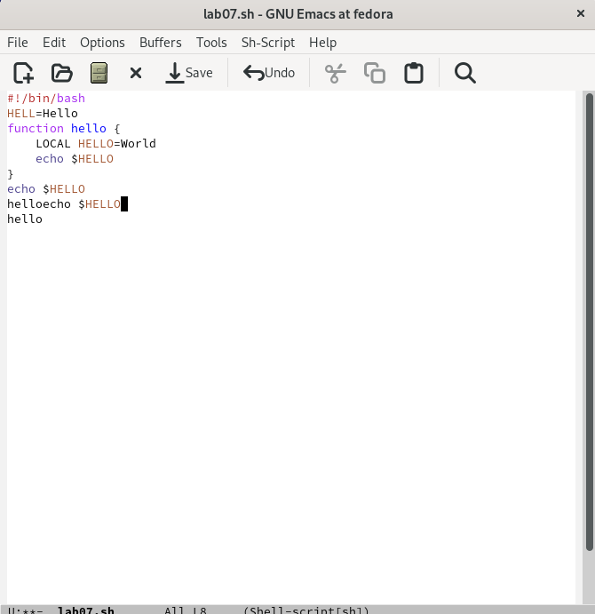{#fig:011 width=50%}

## Выполнение лабораторной работы

6.3. Переместите курсор в начало буфера (M-<).

6.4. Переместите курсор в конец буфера (M->).

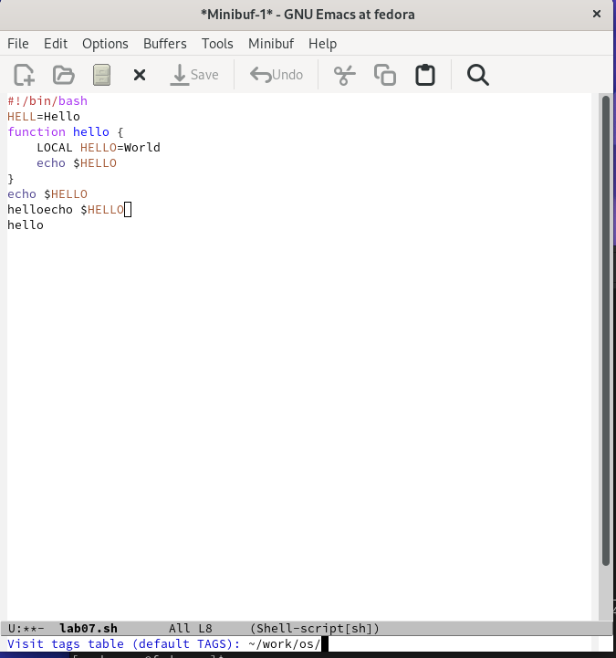{#fig:013 width=50%}

## Выполнение лабораторной работы

7. Управление буферами.

7.1. Вывести список активных буферов на экран (C-x C-b).

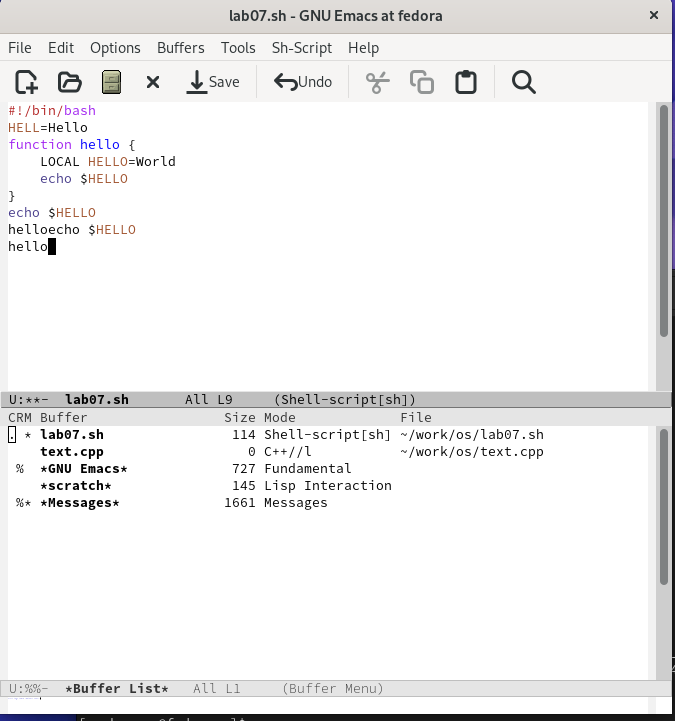{#fig:014 width=50%}

## Выполнение лабораторной работы

7.2. Переместитесь во вновь открытое окно (C-x) o со списком открытых буферов
и переключитесь на другой буфер.

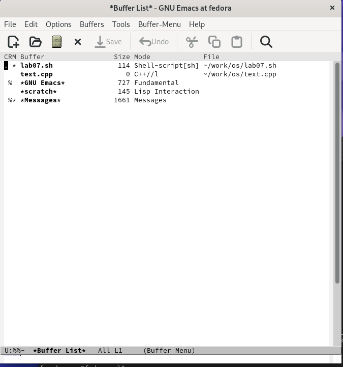{#fig:015 width=50%}

## Выполнение лабораторной работы

7.3. Закройте это окно (C-x 0).

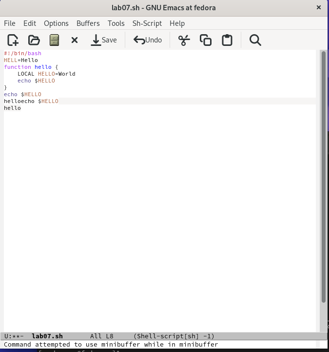{#fig:016 width=50%}

7.4. Теперь вновь переключайтесь между буферами, но уже без вывода их списка на
экран (C-x b).

## Выполнение лабораторной работы

8. Управление окнами.

8.1. Поделите фрейм на 4 части: разделите фрейм на два окна по вертикали (C-x 3),
а затем каждое из этих окон на две части по горизонтали (C-x 2) 

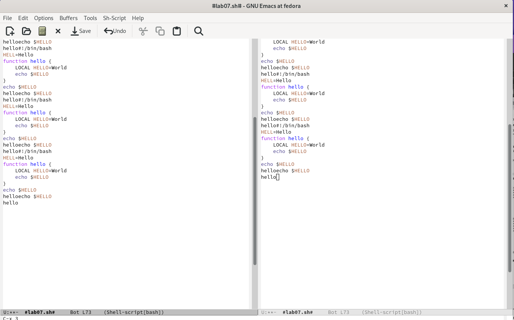{#fig:018 width=50%}

## Выполнение лабораторной работы

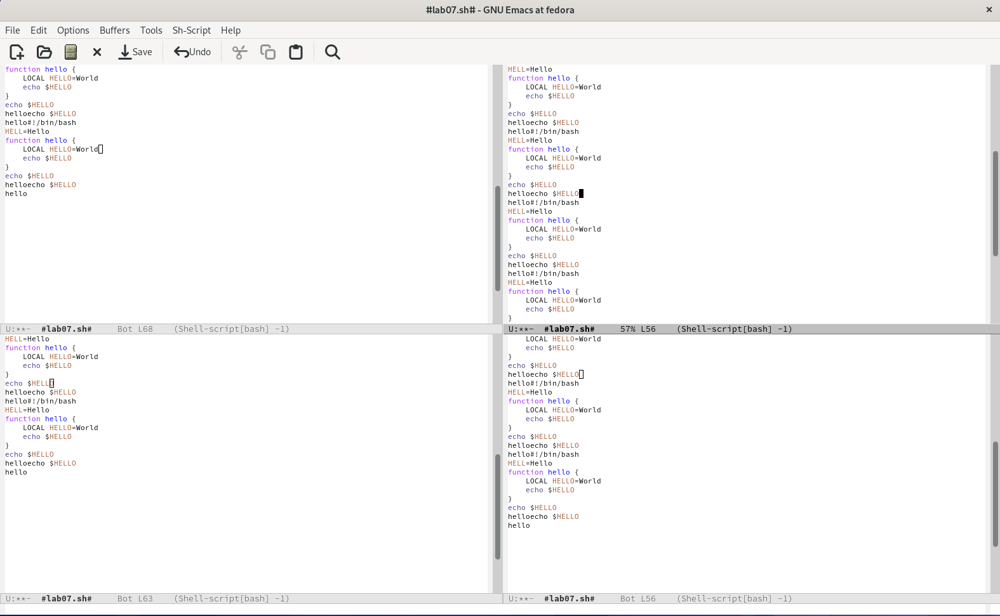{#fig:019 width=50%}

8.2. В каждом из четырёх созданных окон откройте новый буфер (файл) и введите
несколько строк текста.

## Выполнение лабораторной работы

9. Режим поиска
9.1. Переключитесь в режим поиска (C-s) и найдите несколько слов, присутствующих
в тексте.

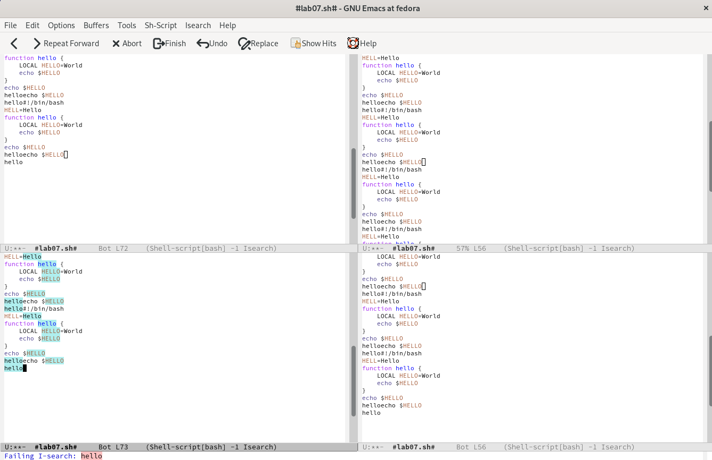{#fig:020 width=50%}

## Выполнение лабораторной работы

9.2. Переключайтесь между результатами поиска, нажимая C-s.

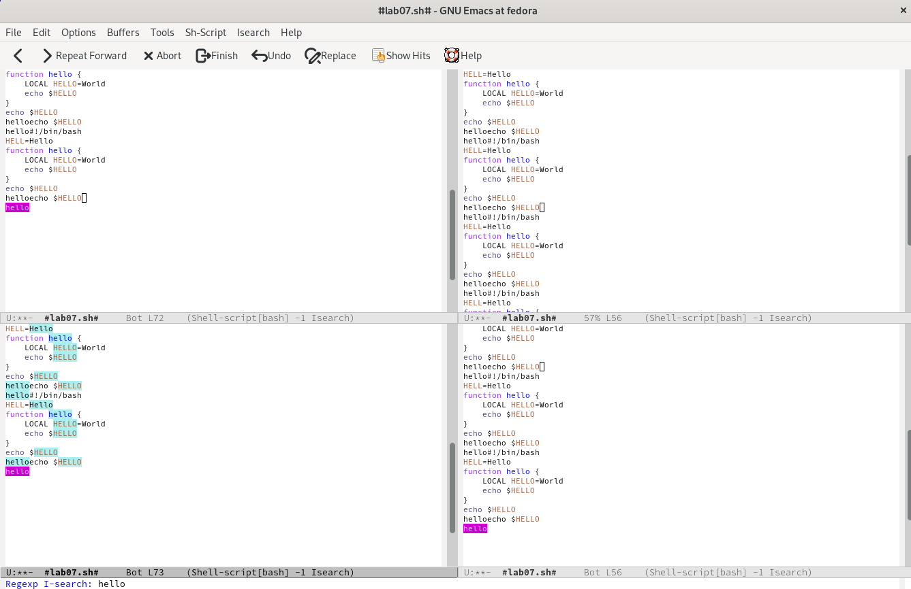{#fig:021 width=50%}

## Выполнение лабораторной работы

9.3. Выйдите из режима поиска, нажав C-g.

{#fig:022 width=50%}

## Выполнение лабораторной работы

9.4. Перейдите в режим поиска и замены (M-%), введите текст, который следует найти
и заменить, нажмите Enter , затем введите текст для замены. После того как будут
подсвечены результаты поиска, нажмите ! для подтверждения замены.

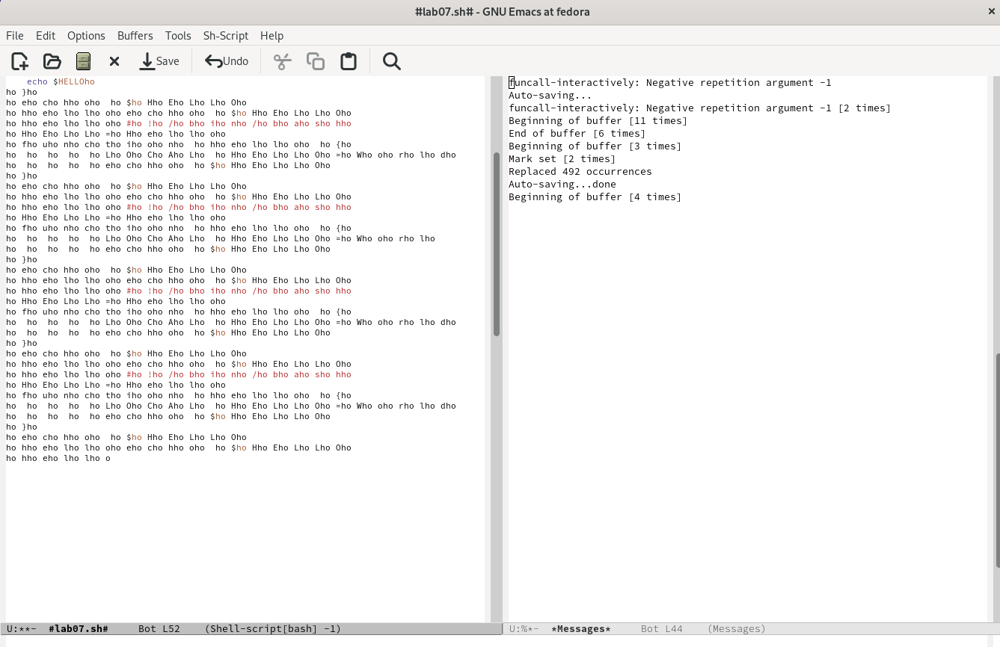{#fig:023 width=50%}

9.5. Испробуйте другой режим поиска, нажав M-s o. Объясните, чем он отличается от
обычного режима?

## Выводы

В результате данной лабораторной работы я познакомилась с операционной системой Linux, получила практические навыки работы с редактором Emacs.

# Список литературы{.unnumbered}

::: {#refs}
:::
