---
#### Front matter
lang: ru-RU
title: Лабораторная работа No 13
subtitle: Средства, применяемые при разработке программного обеспечения в ОС типа UNIX/Linux
author:
  - Акопян Сатеник
institute:
  - Российский университет дружбы народов, Москва, Россия

#### i18n babel
babel-lang: russian
babel-otherlangs: english

#### Formatting pdf
toc: false
toc-title: Содержание
slide_level: 2
aspectratio: 169
section-titles: true
theme: metropolis
header-includes:
 - \metroset{progressbar=frametitle,sectionpage=progressbar,numbering=fraction}
 - '\makeatletter'
 - '\beamer@ignorenonframefalse'
 - '\makeatother'
---

## Цель работы

Приобрести простейшие навыки разработки, анализа, тестирования и отладки при-
ложений в ОС типа UNIX/Linux на примере создания на языке программирования
С калькулятора с простейшими функциями.

## Выполнение лабораторной работы

1. В домашнем каталоге создайте подкаталог ~/work/os/lab_prog.

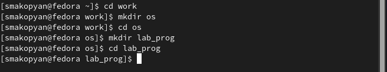{##fig:001 width=50%}

## Выполнение лабораторной работы

2. Создайте в нём файлы: calculate.h, calculate.c, main.c.

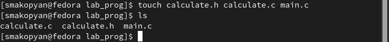{##fig:002 width=50%}

## Выполнение лабораторной работы

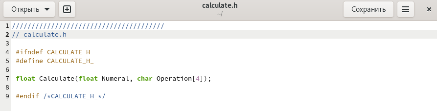{##fig:003 width=50%}

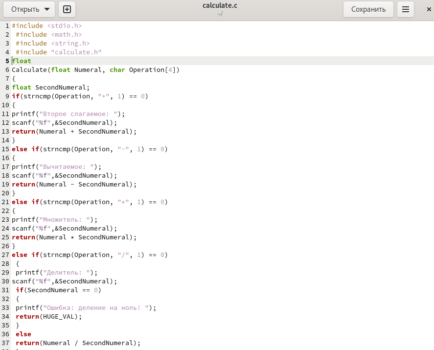{##fig:004 width=50%}

## Выполнение лабораторной работы

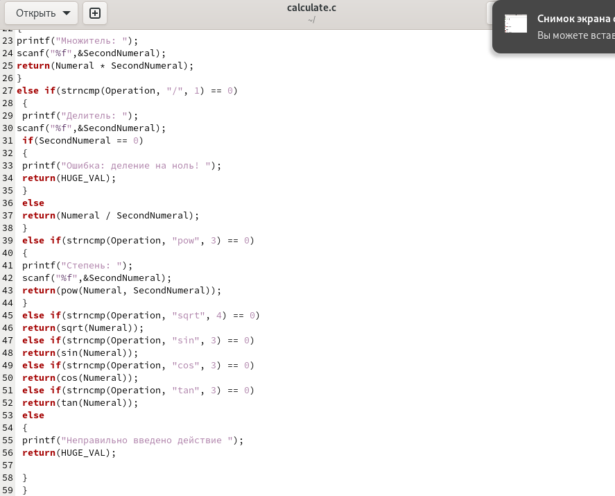{##fig:005 width=50%}

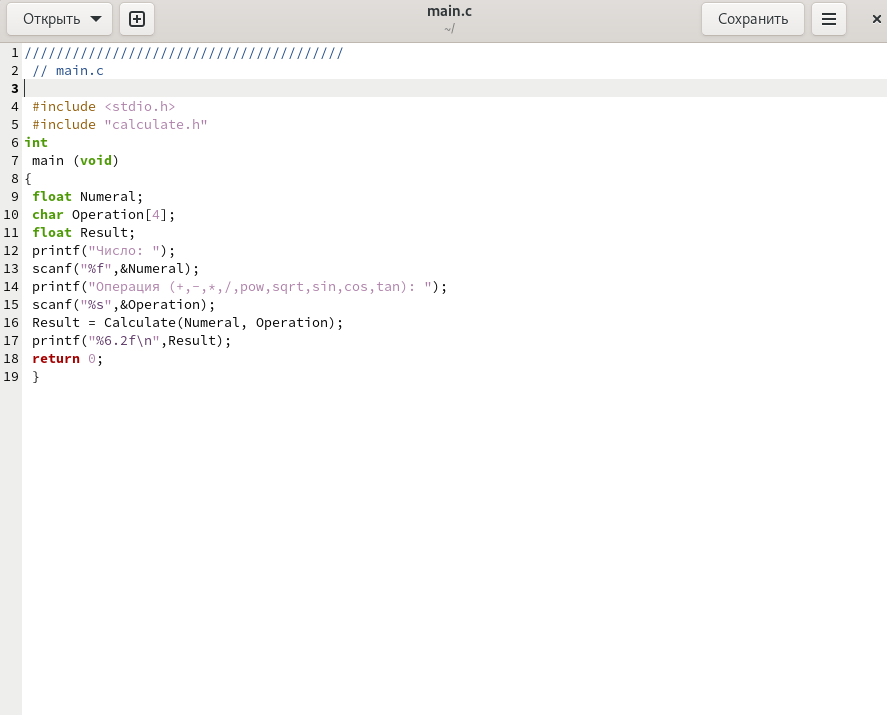{##fig:006 width=50%}

## Выполнение лабораторной работы

3. Выполните компиляцию программы посредством gcc

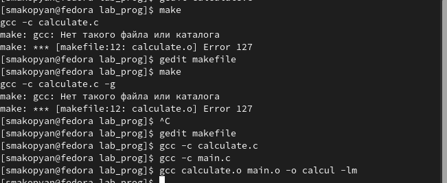{##fig:008 width=50%}

## Выполнение лабораторной работы

4. Cоздайте Makefile со следующим содержанием:

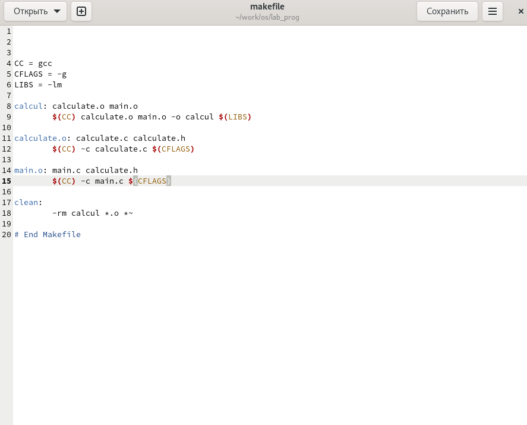{##fig:007 width=50%}

## Выполнение лабораторной работы

5. Запустите отладчик GDB, загрузив в него программу для отладки:

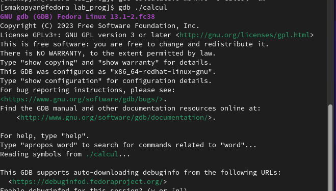{##fig:009 width=50%}

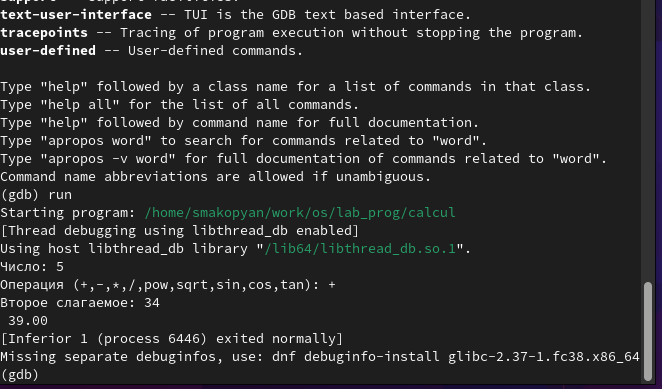{##fig:011 width=50%}

## Выполнение лабораторной работы

6. С помощью утилиты splint попробуйте проанализировать коды файлов calculate.c
и main.c.

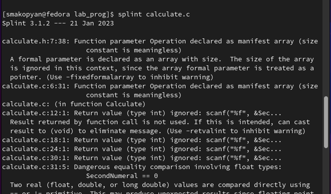{##fig:012 width=50%}

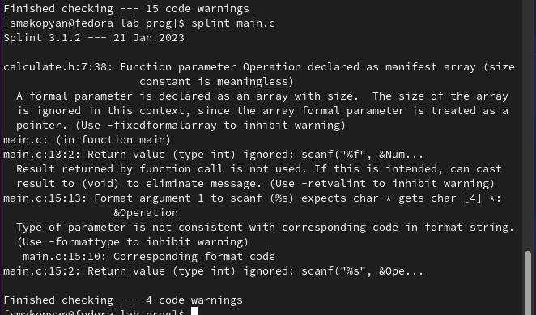{##fig:013 width=50%}

## Выводы

В результате данной лабораторной работы, я риобрела простейшие навыки разработки, анализа, тестирования и отладки приложений в ОС типа UNIX/Linux на примере создания на языке программирования
С калькулятора с простейшими функциями.

## Список литературы{.unnumbered}

::: {##refs}
:::
