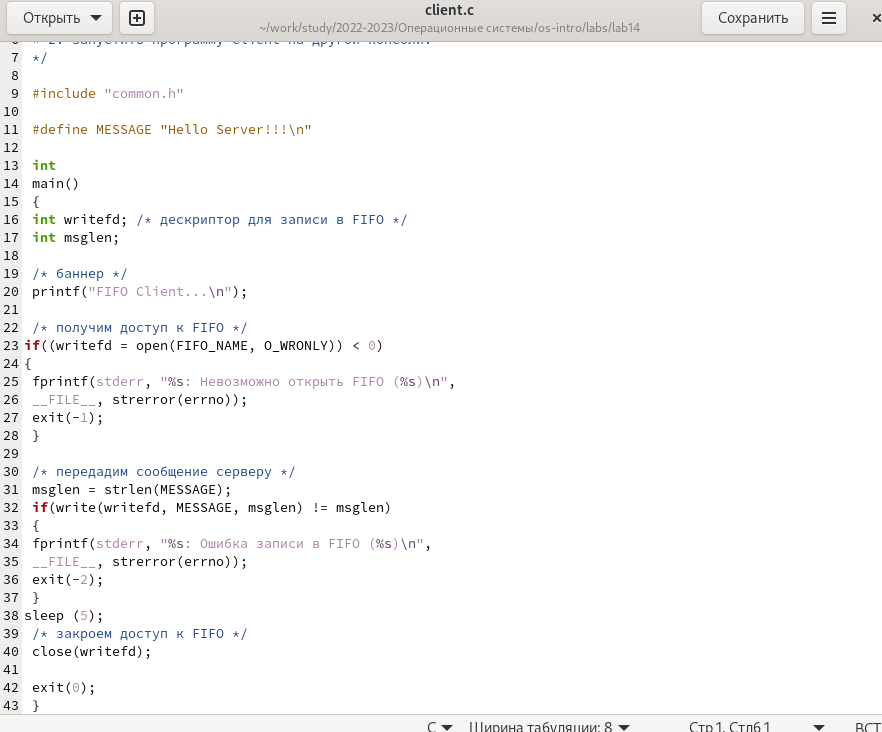

---
## Front matter
lang: ru-RU
title: Лабораторная работа No 14.
subtitle: Именованные каналы
author:
  - Акопян Сатеник
institute:
  - Российский университет дружбы народов, Москва, Россия

## i18n babel
babel-lang: russian
babel-otherlangs: english

## Formatting pdf
toc: false
toc-title: Содержание
slide_level: 2
aspectratio: 169
section-titles: true
theme: metropolis
header-includes:
 - \metroset{progressbar=frametitle,sectionpage=progressbar,numbering=fraction}
 - '\makeatletter'
 - '\beamer@ignorenonframefalse'
 - '\makeatother'
---
## Цель работы

Приобретение практических навыков работы с именованными каналами.

## Выполнение лабораторной работы

Изучите приведённые в тексте программы server.c и client.c. Взяв данные примеры
за образец, напишите аналогичные программы, внеся следующие изменения:
1. Работает не 1 клиент, а несколько (например, два).

{#fig:001 width=50%}

## Выполнение лабораторной работы

2. Клиенты передают текущее время с некоторой периодичностью (например, раз в пять
секунд). Используйте функцию sleep() для приостановки работы клиента.

{#fig:002 width=50%}

## Выполнение лабораторной работы

3. Сервер работает не бесконечно, а прекращает работу через некоторое время (напри-
мер, 30 сек). Используйте функцию clock() для определения времени работы сервера.
Что будет в случае, если сервер завершит работу, не закрыв канал?

{#fig:003 width=50%}

## Выполнение лабораторной работы

{#fig:004 width=50%}

## Выполнение лабораторной работы

{#fig:005 width=50%}

## Выводы

В результате данной лабораторной работы я приобрела практические навыки работы с именованными каналами.

## Список литературы{.unnumbered}

::: {#refs}
:::
