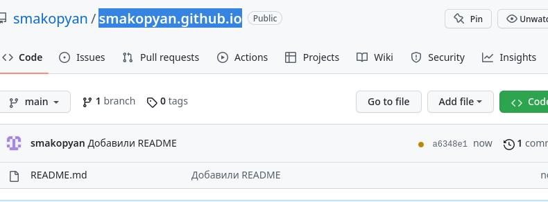

---
## Front matter
lang: ru-RU
title: Отчёт по первому этапу индивидуального проекта
subtitle: Создание сайта на hugo
author:
  - Акопян Сатеник Манвеловна
institute:
  - Российский университет дружбы народов, Москва, Россия
 
## i18n babel
babel-lang: russian
babel-otherlangs: english

## Formatting pdf
toc: false
toc-title: Содержание
slide_level: 2
aspectratio: 169
section-titles: true
theme: metropolis
header-includes:
 - \metroset{progressbar=frametitle,sectionpage=progressbar,numbering=fraction}
 - '\makeatletter'
 - '\beamer@ignorenonframefalse'
 - '\makeatother'
---

## Цель работы

Создать сайт научного работника на hugo.

## Выполнение лабораторной работы

1.Установим необходимое программное обеспечение. 

{#fig:001 width=50%}

## Выполнение лабораторной работы

2.В качестве шаблона индивидуального сайта используется шаблон Hugo Academic Theme. Переходим по ссылке и создаем репозиторий, после чего клонируем его.

{#fig:002 width=50%}

## Выполнение лабораторной работы

{#fig:003 width=50%}

## Выполнение лабораторной работы

{#fig:004 width=50%}

## Выполнение лабораторной работы

3.Перейдем в каталог ~/bin/hugo и выполним команду hugo server, создадутся необходимые файлы, а также ссылка на наш сайт.

{#fig:005 width=50%}

## Выполнение лабораторной работы

{#fig:006 width=50%}

## Выполнение лабораторной работы

4.Создадим еще один репозиторий, чтобы сайт был общедоступным, клонируем его

{#fig:007 width=50%}

## Выполнение лабораторной работы

{#fig:008 width=50%}

## Выполнение лабораторной работы

5.Создаем ветку main, а также пустой файл README, чтобы репозиторий создался.

{#fig:009 width=50%}

## Выполнение лабораторной работы

{#fig:010 width=50%}

## Выполнение лабораторной работы

6.Подключаем созданный репозиторий к папке public

{#fig:011 width=50%}

## Выполнение лабораторной работы

7.Добавляем файлы в репозиторий.

{#fig:012 width=50%}

## Выполнение лабораторной работы

{#fig:013 width=50%}

## Выполнение лабораторной работы

8.Заходим на сайт и убеждаемся, что все создалось.

{#fig:014 width=50%}

## Выполнение лабораторной работы

{#fig:015 width=50%}

## Выводы

В результате данной лабораторной работы, я научилась создавать сайты на hugo.

