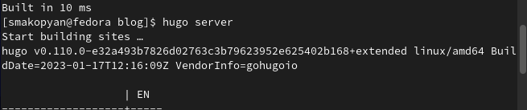
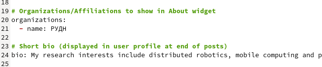
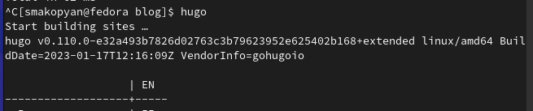
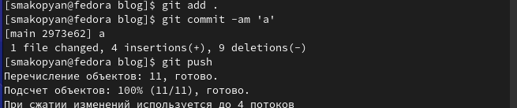
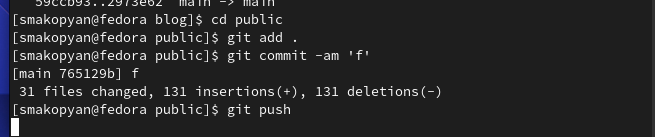
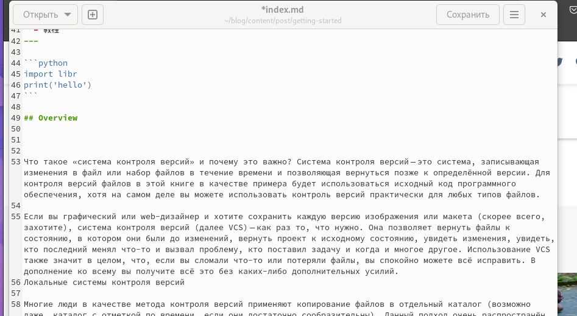
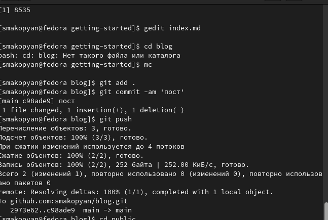

---
## Front matter
lang: ru-RU
title: 2 этап индивидуального проекта
subtitle: добавление информации о себе
author:
  - Акопян Сатеник Манвеловна
institute:
  - Российский университет дружбы народов, Москва, Россия
  - Объединённый институт ядерных исследований, Дубна, Россия
date: 01 января 1970

## i18n babel
babel-lang: russian
babel-otherlangs: english

## Formatting pdf
toc: false
toc-title: Содержание
slide_level: 2
aspectratio: 169
section-titles: true
theme: metropolis
header-includes:
 - \metroset{progressbar=frametitle,sectionpage=progressbar,numbering=fraction}
 - '\makeatletter'
 - '\beamer@ignorenonframefalse'
 - '\makeatother'
---

## Цель работы

Добавить на сайт информацию о себе

## Выполнение лабораторной работы

1. Разместить краткое описание владельца сайта (Biography).

2. Добавить информацию об интересах (Interests).

3. Добавить информацию от образовании (Education).

{#fig:001 width=50%}

## Выполнение лабораторной работы

{#fig:002 width=50%}

## Выполнение лабораторной работы

{#fig:003 width=50%}

## Выполнение лабораторной работы

{#fig:004 width=50%}

## Выполнение лабораторной работы

{#fig:005 width=50%}

## Выполнение лабораторной работы

{#fig:006 width=50%}

## Выполнение лабораторной работы

4. Добавить пост на тему управление версиями. Git.

{#fig:007 width=50%}

## Выполнение лабораторной работы

{#fig:008 width=50%}

## Выводы

Добавили на сайт информацию о себе

# Список литературы{.unnumbered}

::: {#refs}
:::
